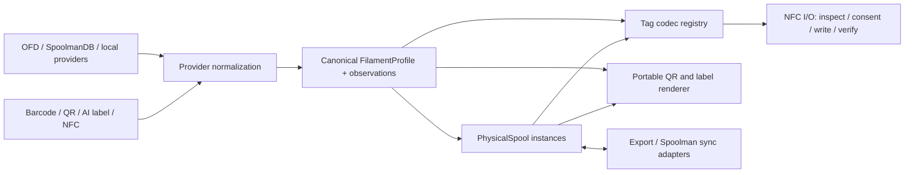
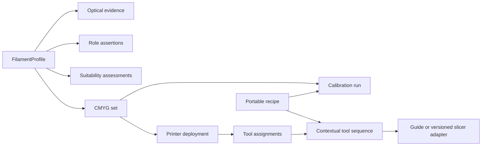

# Pivot architecture

## Boundaries

### Full Spectrum extension

The owner-approved direction in [`FULL_SPECTRUM_PRODUCT_DIRECTION.md`](FULL_SPECTRUM_PRODUCT_DIRECTION.md) extends the canonical side of this diagram. M7 implements optical characterizations plus evidence-bearing appearance, role, and suitability assertions. Reusable CMYG sets, portable recipes, calibration runs, printer deployments, and contextual tool assignments remain later milestones. Full Spectrum concerns do not enter tag codecs or make Snapmaker tool numbers part of profile identity.

M8 queries saved profiles through canonical Room projections. Structured filters use indexed active role assertions, current TD evidence, assessment/test state, and physical-spool ownership. CMYG completeness is a deterministic set operation. Alternate candidates expose assertion authority and evidence identifiers without ranking a best set.

The M7 foundation preserves unknown TD and untested suitability as explicit states and keeps recommended and observed assessments separate. Future set and recipe work must preserve incomplete combinations; target, predicted, observed, and measured colors remain separate. White and Black are optional anchors outside the CMYG mixing basis. A future Snapmaker Orca adapter must be pinned to validated slicer versions and fail closed on incompatible project schemas.

### External catalog providers

`CatalogProvider` exposes provider identity/licensing, search, and record retrieval. Each adapter maps its source schema into `FilamentProfile` observations. Providers do not write Room entities or decide conflict precedence. The present OFD asset/importer remains usable while it is moved behind this interface; the merged GTIN index remains an identification index, not canonical truth.

### Canonical profile and provenance

`FilamentProfile` represents a reusable product/color/package definition. Values use `ObservedValue<T>` and `SourceRef`, carrying provider, source record, revision/time, evidence kind and optional confidence. Conflicting observations remain available; a user-selected current value does not erase alternatives. `ExternalIdentifier` keeps scheme, issuer and market, preventing SKU, GTIN, ASIN-like and QR values from collapsing into one string.

User database v6 copies legacy TD history once into authoritative `optical_characterizations`, with unit, method, conservative origin, geometry, wall/layer thickness, evidence, confidence, notes, and supersession. The legacy TD table remains read-only for compatibility rollback/export. An AJAX-3D TD1 adapter remains optional. No universal TD suitability bands are currently validated.

The current `FilamentRecord` remains as the compatibility model used by the working UI, Room mapper and OpenSpool pipeline. Replacing it in one step would risk proven NFC behavior. Later migration maps it to the canonical profile and keeps stable IDs/source values.

### Physical spool

`PhysicalSpool` holds instance identity, initial/remaining amount, purchase/vendor/location/opened data, notes/custom metadata and zero or more `TagBinding`s. Multiple spools reference one profile ID. Drying history is intentionally deferred; the model can add events without changing profile identity.

### Tag codecs

`CompatibilityResolver` sits between printer selection and encoding. It records target ecosystem IDs, physical tag families, read/write capability, native versus alternate-firmware compatibility, and firmware/RFID/processor requirements. Selecting CANVAS plus U1/PAXX resolves to one NTAG215 and the `elegoo-canvas-1.0` codec; selecting stock U1 in that combination is rejected. Existing direct format selection remains available as an advanced workflow.

`FilamentTagCodec` separates pure serialization from Android NFC. Each format declares one transport: NDEF, raw NTAG21x pages, the documented QIDI MIFARE Classic block, or the three-block authenticated Creality CFS layout. `StandardOpenSpoolTagCodec` and `PaxxU1ExtendedTagCodec` remain distinct adapters over `OpenSpoolCodec`. `ElegooCanvasTagCodec` emits only the 64-byte CANVAS block placed at absolute Type 2 offset `0x40` (pages 16–31); it never adds an OpenSpool record. `EncodedTag` exposes exact storage length and a capacity predicate.

OpenPrintTag, Anycubic ACE, Creality CFS, OpenTag3D, QIDI Box, and TigerTag have independent serializers and decoders. This avoids treating a shared chip model as a shared data format. QIDI output rejects colors outside its registered palette instead of silently changing them. CFS cryptography remains inside its codec, while UID-derived sector authentication and trailer initialization remain inside the Android NFC transport; neither key material nor decrypted block data is logged.

PAXX target identity is `v1.5.2-paxx12-21`. Its payload is OpenSpool `application/json`, protocol `openspool`, version `1.0`, with numeric extended fields. The existing adapter writes `protocol`, `version`, `type`, `color_hex`, `brand`, optional numeric `min_temp`/`max_temp`, `subtype`, bed range, numeric decimal `diameter`, integer `weight`, plus separately documented extensions. Generic OpenSpool intentionally omits those extended fields. Unknown decoded fields remain read-only rather than being stripped.

### NFC I/O

`NfcCoordinator` and `WriteStateMachine` remain the physical boundary: discovery/active reads, UID/content-bound overwrite consent, frozen intent, capacity check, write, fresh read-back, exact multi-record or raw-byte verification, durable `WRITE_OUTCOME_UNKNOWN`, and read-only reconciliation. The CANVAS path issues NTAG `GET_VERSION`, accepts only an identified NTAG215, checks the relevant dynamic lock/block-lock bits and password-protection boundary, displays the detected type, writes only pages 16–31, and verifies the exact 64-byte block through a fresh read and CANVAS decode. Unknown target-page content is never overwritten. All 504 user bytes are read in four-page groups; any payload outside pages 16–31 is preserved by rejecting the tag before writing, so the result cannot silently retain a competing OpenSpool/NDEF payload. The standard factory empty-NDEF marker is allowed because it contains no record and is not modified. OpenPrintTag requires Android NFC-V and an already NDEF-writable tag; automatic formatting, password handling, and protected-region unlocking remain disabled. MIFARE Classic availability depends on the Android phone's NFC controller. CFS blank initialization requires factory Key A authentication plus the complete documented transport trailer before any mutation. Verification requires derived Key A authentication, unchanged access bytes, the readable derived Key B value, and an exact data readback; the journal retains that requirement across restart. This follows the transport access configuration, under which Key B is readable rather than an authentication credential. A default-keyed tag whose full ciphertext exactly matches the same journaled UID and payload can expose a trailer-only resume action, but no retry occurs until the user explicitly approves and re-taps. Encrypted data alone is not accepted as a verified CFS write. A tag operation may create several bindings for one spool; the UI must allow finishing after one tag or writing the recommended second opposite-face tag.

### QR and labels

Discovery codes already on packages are evidence inputs. SpoolForge-generated QR is an output identity. The implemented legacy [`filamajig.spool` version 1 contract](PORTABLE_IDENTITY.md) is a self-contained UTF-8 payload containing distinct stable profile and physical-spool IDs, a compact profile snapshot, and initial/remaining quantity. Full bundles add per-field sources. A proprietary cloud URL is never the sole identity. Labels render configurable human-readable values from the same frozen export intent.

### Persistence and migration

Existing OFD catalog and user-record databases stay intact. User database v5 adds `filament_profiles`, `profile_observations`, `profile_overrides`, `profile_identifiers`, `physical_spools`, `tag_bindings`, and `transmission_distance_measurements` alongside the compatibility tables. Migration 4→5 deterministically backfills one profile and one spool per saved record, copies every populated legacy value with its source, retains conflicting observations, pins the current legacy value, and keeps GTIN/part-number identity separate. New local saves and deletes cross the `LocalFilamentRepository` transaction boundary so compatibility and canonical storage cannot drift.

The migration is additive and keeps `custom_records` and `recents` unchanged as a rollback backup. A 5→4 rollback migration removes only canonical tables. If another owned spool starts sharing a migrated profile, deleting the compatibility record detaches that profile instead of deleting shared inventory. Provider refreshes may add observations, but they do not update `profile_overrides`; deduplication remains a later, reviewed operation.

## Data-source strategy

- **OFD:** primary bundled/cacheable provider; best hierarchy and explicit MIT redistribution.
- **SpoolmanDB Community:** secondary breadth/enrichment provider after deduplication and field-conflict acceptance tests.
- **Local/manual:** first-class provider for unknown/private-label filament.
- **OpenPrintTag database:** future identifier/color/TD enrichment candidate; keep its schema and hardware standard separate.
- **3D Filament Profiles:** competitive reference and optional future authorized provider. Do not scrape or use authenticated browser state.
- **Amazon/Rainforest/Icecat:** removed from the focused strategy. Historical research remains for traceability; none is a runtime dependency.

## Security and privacy

Core data stays on device. Provider credentials, if a future provider needs them, must not be part of release APKs. Current debug-only direct AI key embedding is a prototype limitation and must be removed or replaced by user-managed/on-device or protected service configuration before release. Images are transient; accepted values retain evidence metadata, not the photograph by default.
