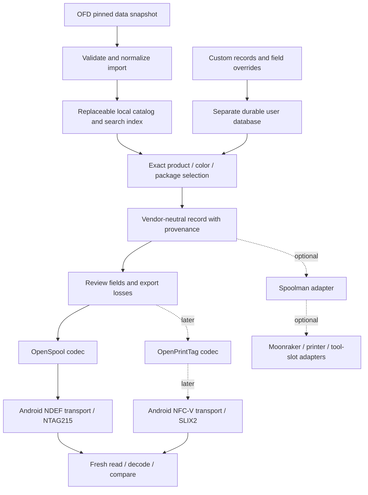

# Filament Tag Manager — feasibility assessment

Research snapshot: 6 September 2026, America/Los_Angeles (retrieval continued on 7 September UTC). Scope: investigation only. No application, codec, service, firmware, or database implementation was created or installed. Proposed architecture below is advisory and requires owner approval before implementation.

**Research conclusion: FEASIBLE WITH LIMITATIONS.** A printer-neutral, offline Android filament catalog and open-tag manager is technically justified. Universal recognition by stock printers is not feasible: incompatible radio technologies, vendor formats, reader hardware, firmware interpretation, and protected vendor identities remain real boundaries.

**Recommendation:** create a small native Kotlin Android application with independently testable domain, catalog-import, and codec modules. Start with **Open Filament Database (OFD), OpenSpool, and the owner's existing NTAG215 tags**. Include read/decode, edit/rewrite, explicit field provenance, custom records, and actual read-back verification. No account, telemetry, proprietary backend, Spoolman server, or printer connection is required for the core workflow. Add OpenPrintTag on NFC-V hardware after its separate interoperability gate; keep Spoolman optional.

**Distribution boundary:** proposed M1 ships a bundled OFD snapshot generated from its pinned, MIT-licensed public source. **No live catalog refresh is promised in M1.** All four tested hosted bulk endpoints returned 403; their cause and mobile-client accessibility remain unknown. Automatic refresh is a later gate requiring a documented, permitted successful download and validation with the intended Android client. OFD selection rests on its inspected hierarchy, coverage and reuse rights, not proven hosted download reliability. No header spoofing or alternate route is proposed to evade the observed denial.

**Strategic answer:** call this a **Filament Tag Manager**, not a Snapmaker U1 writer. OpenSpool, OpenPrintTag, documented vendor initiatives, and Spoolman/Moonraker provide enough independent interoperability to justify the broader domain. Printer compatibility belongs in adapters and compatibility profiles. This does not mean every printer can read the same tag.

Review status is maintained separately in [REVIEW.md](REVIEW.md). Source commits and paths are in [SOURCES.md](SOURCES.md); measured data is in [catalog-metrics.json](../research/evidence/catalog-metrics.json) and [additional-metrics.json](../research/evidence/additional-metrics.json).

## 1. What is established, and what is not

Established from current primary documentation, pinned public source, and actual catalog records:

- OFD explicitly licenses its data for reuse and commercial embedding under MIT; JSON, NDJSON, CSV and SQLite distributions are documented and have corresponding exporters.
- The precise brand → material grouping → product line → color variant → package hierarchy exists in OFD; it is not a hypothetical app model.
- Android supports writing and freshly reading NDEF tags. An API returning normally is insufficient evidence for this product's success state.
- OpenSpool uses NDEF JSON. OpenPrintTag uses NDEF with structured CBOR and specifies ISO15693/NFC-V hardware. Payload format and radio compatibility are separate.
- PAXX explicitly states that the U1 built-in hardware cannot read ISO15693 OpenPrintTag tags. NTAG215/216 OpenSpool support is present in extended firmware. This remains true with PAXX installed.
- Existing applications provide useful evidence, but none inspected establishes all requested V1 acceptance criteria without changes.

Not established: the owner's phone model/NFC chipset, exact installed PAXX build, tag authenticity/capacity/locks, placement reliability, completed physical writes, printer interpretation, mobile search timing, and deployed-app behavior. No claims of a hardware test or successful application build are made.

The OFD hosted API returned HTTP 403 to the direct download client for index, manifest, compressed JSON, and SQLite. The public API landing page was readable through web research; the public Git repository and actual source dataset were independently accessible. No credentials, alternate identities, or access-control bypass were used. Published binary sizes, validators and successful bulk-client behavior are therefore **unverified**, not inferred from source code. This does not prevent evaluating the openly licensed catalog snapshot. An additional source validation parsed and hashed every retained OFD data JSON file, with per-file digests in `research/evidence/OFD-SOURCE-SHA256SUMS` and counts in `ofd-snapshot-validation.json`. This establishes an auditable build input, not an already implemented importer or verified Room artifact.

## 2. Data-source comparison

Counts below are measured in retrieved data, not interchangeable marketing totals. OFD source was pinned to `e3888b68`; OpenPrintTag database to `f2fd57dd` on its actual default branch `main-pr`. SpoolmanDB Community source was pinned to `56ed3657`; its separately fetched public compiled artifact is an independently dated snapshot and is not claimed to be built from that exact commit.

| Source | Measured scope | Data and distribution rights | Field quality and barcode evidence | Distribution and recommendation |
|---|---|---|---|---|
| OFD | 166 brands; 714 brand/material groups; 38 distinct material labels; 2,089 product lines; 14,569 color variants; 22,347 packages | Data explicitly MIT, as well as repository code. Preserve LICENSE notice despite README's less strict attribution wording | All variants have a color value; 1,585 product lines have minimum nozzle temperature; 1,590 maximum. 2,693 packages have GTIN or legacy EAN (12.05%); only 2,640 pass a basic GTIN length/check-digit test | Daily static API, JSON/gzip, NDJSON, CSV, SQLite/xz, search and GTIN indexes; best V1 hierarchy and offline distribution |
| OpenPrintTag database | 128 brands; 14,245 material records including non-FFF entries; 10,304 packages; 93 containers | Repository README specifically presents the material database under MIT; retain notice. Photos and manufacturer artwork need separate rights clearance | 12,749 primary RGBA colors; 1,485 secondary-color sets; 38 LAB and 41 RAL primary values. 6,193 packages have GTIN (60.10%); 3,730 materials have minimum print temperature | YAML repository, schema pin and validation tools; excellent package/barcode enrichment candidate, but defer multi-source merging |
| SpoolmanDB Community | Public output: 489 manufacturers, 53,355 expanded variants | MIT plus TERMS explicitly allowing public JSON use; terms say they do not narrow MIT permissions; contributions must have redistribution rights | 39,992 rows have nozzle ranges, 4,610 have `eans`, 90 `eans_refill`, 13,801 `codes`. Expansion across weights/diameters means counts are not unique products or unique barcode coverage | Public compiled JSON and material defaults, source schemas and compatibility gates; valuable alternative if breadth outweighs OFD hierarchy |
| Original Donkie/SpoolmanDB | Not separately recounted; original lineage of Community dataset | MIT upstream; Community is independent, not the official Spoolman server | Useful established contract, but avoid treating forks as independent corroborating sources | Prefer Community for a later breadth experiment; do not download both into V1 |
| TheFilamentDB | Current complete record count not measured in this investigation | Explicit dataset CC-BY-4.0; attribution and indication of adaptations required | Product/name/color/diameter and manufacturer-page data; color can be inferred from its name. Seller data, ratings and images excluded | Daily gzipped JSONL. Legitimate alternative, but no demonstrated package/barcode advantage over OFD/OPT; not V1 |
| TigerTag reference registry | Identifier dictionaries, not a demonstrated full retail SKU catalog; not counted as products | `database/*.json` CC0; separate specification/code/marks licenses | Useful material/brand/code tables for its binary format | Suitable codec lookup data if TigerTag is adopted, not a substitute for exact catalog variants |
| OpenFilament.nl / Open-Filament | Public catalog/profile projects identified; independent dataset size and complete redistribution rights not verified | Public visibility alone is insufficient | Machine-calibrated and calculated profile concerns differ from exact product identity | Not approved as a bundled V1 source on current evidence |

Sources: [OFD repository](https://github.com/OpenFilamentCollective/open-filament-database), [OFD API landing page](https://api.openfilamentdatabase.org/), [OpenPrintTag database](https://github.com/OpenPrintTag/openprinttag-database), [Community dataset](https://github.com/Icezaza2543/SpoolmanDB-Community), [TheFilamentDB export terms](https://thefilamentdb.com/database), [TigerTag licensing](https://github.com/TigerTag-Project/TigerTag-RFID-Guide/blob/5e1907697c054f07d2bd5d59a2976af010209699/LICENSING.md).

### Quality cautions that affect selection

OFD's 2,693 populated barcode packages contain 2,595 distinct raw identifiers; 88 identifiers occur more than once. A checksum-valid barcode is neither proof of correct assignment nor proof that it resolves one package. Barcode lookup must return candidate packages and preserve leading zeros. Do not invent codes from SKUs or hashes.

OpenPrintTag's README counters were behind the actual tree: live source has substantially more packages than the previously advertised 4,720. SpoolmanDB's README advertised 53,317 expanded rows, while fetched output contained 53,355. These are snapshot differences, not evidence of corrupt data.

Temperature and density field presence does not prove manufacturer measurement. SpoolmanDB can apply shared material defaults and expands source entries across package combinations. OFD density is populated on all product lines, but should still carry source attribution and verification status. OPT's richer schema does not make all its records rich: many have empty `properties`.

### V1 source decision

Use **OFD alone**, importing a pinned source revision and retaining raw values. Its package separation is already appropriate, and the sample use case works. OPT has a materially better populated GTIN proportion and useful independent schema, but adding it initially creates duplicate, ID, license-notice and conflict-management costs. Before a second importer, measure incremental correctly matched products on a representative user-selected sample. Shared/imported data must not be counted as independent confirmation.

No 3DFilamentProfiles scraping was used or proposed. Manufacturer pages are evidence for corrections, not a blanket permission to redistribute their images or entire catalogs.

## 3. OFD API, hierarchy and versioning

Canonical project: OpenFilamentCollective/open-filament-database, facilitated by SimplyPrint. Current source files are **JSON**, despite the hosted `/docs` page describing YAML. Prefer pinned source schemas and exporter output over stale prose.

Actual layout:

```text
brand.json                          brand identity, country, website, source note
  MATERIAL/material.json            brand's material category and defaults
    product/filament.json           product line, physical/recommendation fields
      color/variant.json            named color, HEX, traits, discontinued state
      color/sizes.json[]            diameter, net mass, container and retail IDs
```

This is not a separate manufacturer → brand ownership hierarchy: the database's brand entity generally represents the market-facing supplier. Keep actual manufacturer nullable in our model; do not manufacture an OEM identity from a brand name.

The API base is `https://api.openfilamentdatabase.org/api/v1/`. Documented endpoints include `brands/index.json`, hierarchical brand/material/product/variant paths, schemas, and indexes. Exporter source also creates `search-index.json`, `gtin-index.json`, and UUID resolution. Bulk files are `/json/all.json`, `/json/all.json.gz`, `/json/all.ndjson`, `/sqlite/filaments.db`, `/sqlite/filaments.db.xz`, and CSV tables. These URLs are documented, but direct downloads in this environment returned 403.

The API index includes `version`, `generated_at`, optional source `commit`, counts and endpoint links. Observed landing-page version is `v2026.09.06`, generated `2026-09-06T23:51:05Z`; its counts match the inspected source. Daily rebuild is documented; there is no demonstrated SLA, supported incremental delta API, or guarantee that a calendar version freezes a schema. Pin commit plus content digest and importer schema version. OFD uses explicit UUIDv4 values and `moved_from` aliases; do not regenerate identity from a display-name change.

### Field inventory and ownership

| Requested property | Actual evidence in OFD | Normalized owner / treatment |
|---|---|---|
| Manufacturer, brand, family, name | `brand.name`, `filament.name`; no independent manufacturer or family entity | Brand and product; family/manufacturer nullable |
| Material, subtype | `material.material`; subtypes often embedded in product name; variant traits | Material classification plus separately sourced subtype; avoid guessing `PLA+` chemistry |
| Additives, finish, specialty flags | Variant `traits` include fiber/abrasive/visual characteristics | Variant-level traits; retain unknown flags and provenance |
| Color name, primary/secondary | `variant.name`, `color_hex`; source schema supports lists; inspect shape rather than assuming scalar | ColorVariant with multiple ColorSamples |
| HEX/RGB | HEX stored; RGB can be derived exactly from HEX | Record conversion, not a new measured observation |
| LAB/RAL/Pantone | `color_standards` extensible entries; 154 variants populated; no dedicated universal LAB/RAL/Pantone columns | Preserve standards labels verbatim; never infer a licensed Pantone/RAL swatch lookup |
| Diameter, tolerance, density | Size `diameter` in mm; product `diameter_tolerance`, `density` | Physical/package option; density source-tagged |
| Nozzle, bed, chamber | Product min/max print, bed and chamber fields; some preheat/chamber setpoints | Recommendations with scope and units |
| Volumetric flow, cooling/fans | Possible slicer settings dictionaries; not a universally populated dedicated product property | Slicer/context-dependent recommendation, not universal identity |
| Drying | Product `max_dry_temperature`, material default; not the same as a timed drying recipe | Store max-safe recommendation separately from target temperature and duration |
| Net/empty/gross mass | Size `filament_weight`, `empty_spool_weight`; no separate measured gross field | Net and tare; derived gross only labeled calculated and valid for defined components |
| Length | No dedicated size field in inspected schema | Nullable; calculate only from diameter/density/mass with explicit assumptions |
| SKU/UPC/EAN/GTIN/product IDs | Size `article_number`, `gtin`, deprecated `ean`, other barcode/NFC/QR identifier slots | Scheme-tagged identifiers with issuer/region; UPC is GTIN-12, not a new generated value |
| Variant IDs | UUID on product/color/size, path IDs and aliases | Store all source identities, not a guessed cross-database UUID |
| Source URLs | Brand website/source; product data/safety sheets; size purchase links | SourceObservation reference and acquisition revision |
| Slicer data | Product `slicer_settings`, `slicer_ids`; material defaults; Orca exporter | Separate scoped SlicerProfile, never automatically apply tuning to a printer |
| Container dimensions/refill | Size spool/core and container dimension slots; `spool_refill` | Package/Container; absent values stay absent |

### Verified example

OFD `data/sunlu/ABS/abs/orange/variant.json` identifies Orange as **#FF8E24**. Product `filament.json` gives nozzle **230–260°C**, bed **90–110°C**, density **1.04 g/cm³**, tolerance **0.02 mm**. Its single size is **1.75 mm / 1,000 g** with UUID `14417b3a-38d3-4643-ace8-40bdc9b7ecf3`; no GTIN or tare mass is supplied. Orange and Sunny Orange are distinct variants. The illustrative #FF6A00 in the request is not source evidence. OPT also records ABS Orange #ff8e24ff but has empty properties for that material in the inspected snapshot; do not count agreement as independent measurement.

## 4. Normalized domain proposal

This is a conceptual schema, not an implemented interface or an irreversible architecture decision.

| Entity | Proposed fields and constraints |
|---|---|
| Brand | local stable ID; displayName; aliases; optional manufacturer relation; source identities |
| Product | brandId; name; optional family; material class; material type; raw material label; optional subtype |
| ColorVariant | productId; name; ordered color samples; appearance/additive traits; active/discontinued state |
| ColorSample | sRGB RGBA when available; optional LAB with illuminant/observer metadata; named color-standard references; measured/reported/derived flag |
| PhysicalVariant | colorVariantId; diameter µm; tolerance µm; density g/cm³; hardness; source observations |
| PackageVariant | physicalVariantId; nominal net mass g; nominal length mm; containerId; refill flag; identifier list; market/region; source URL |
| Container | nominal tare g; dimensions mm; material; reusable status; optional manufacturer |
| RecommendationSet | product/variant scope; nozzle/bed/chamber ranges °C; drying target/duration/max limit; cooling/flow only with machine/nozzle/context and provenance |
| SlicerProfile | external profile ID, slicer/version, printer, nozzle, calibration context; flow ratio, PA, retraction, cooling curves; separate from identity |
| SpoolInstance | local UUID; selected package; actual initial mass; optional remaining measurement; location/purchase/history; zero or more tag bindings |
| TagBinding | technology plus hardware UID bytes; logical spoolInstanceId; format/profile/revision; verified-at; expected serialized payload hash; operation status |
| SourceObservation | source, record ID, JSON pointer/YAML field path, source revision/content hash, URL, retrievedAt, rawValue, unit, derivation, confidence |
| Override | owner record ID, field path, chosen value, previous observation reference, local timestamp; catalog edits never mutate upstream snapshot |
| IntegrationBinding | backend identity plus remote spool ID, observed version/time, last sync result; printer/tool/slot assignments are separate state |

All unknowns are null/absent, not zero, white, PLA, 1 kg, or Generic unless the user explicitly chooses that value. Use integers for micrometre diameters and decimal-safe conversions for weights/density. Brand aliases aid search but do not prove equivalent products. Maintain packaging distinct from a physical spool: two purchased spools share product/package metadata but must not share inventory history accidentally.

Provenance belongs to individual field observations. A renderer can default to OFD's source value while showing a conflict list. A user override wins for that local record, with the original observation retained. Manufacturer evidence can be preferred when exact variant, region and date are verified; do not silently select the newest or highest temperature. Source disagreement is not averaged away. Updating the catalog refreshes candidates without deleting custom records or overriding user choices.

## 5. Tag standards and legitimacy boundaries

| Format | Encoding / hardware | IDs, state, integrity | Maturity / interoperability | V1 judgment |
|---|---|---|---|---|
| OpenSpool | One NDEF `application/json` record, UTF-8 JSON, `protocol=openspool`, `version=1.0`; documented NTAG215/216 | Core spec has no universal spool-instance ID or remaining-weight protocol; hardware UID external to payload. No app-level signature/checksum | Small community format with several reader/writer implementations; consumer behavior differs | First format: matches owned tags and U1/PAXX, yet usable by independent readers |
| OpenPrintTag | NDEF `application/vnd.openprinttag`; integer-key CBOR meta/main/optional aux regions; ISO15693 NFC-V, designed around 320-byte ICODE SLIX2 | Explicit/derived brand/material/package/instance UUIDs; GTIN; aux consumed mass/workgroup; no cryptographic authenticity promise | Richer, maintained open spec and database, Prusa/mobile/community support; hardware-specific printer adoption must be checked | Second codec and NFC-V transport; not NTAG215 compliance |
| TigerTag 2.1 | Fixed binary NTAG21x page layout; 80 bytes base plus optional 64-byte signature; no NDEF MIME container in that layout | Registry numeric IDs, colors, quantities, remaining quantity, temperatures, optional authenticity; factory UID immutable | Credible open implementation grant; raw-memory codec and registry dependencies; broad adoption claims are vendor assertions | Later candidate, not needed to make V1 useful; unsigned legitimate custom tags only |
| Spoolman URL/QR/UID pairing | Application convention using an inventory URL, ID, or UID mapping | Backend-local identity, often requiring LAN/backend; no standalone product payload standard | Useful complement for printers without NFC | Optional inventory adapter, not an interchangeable standard |
| SpoolEase / SpoolSense | External-reader and software workflows; SpoolEase has its own NTAG NDEF conventions; SpoolSense supports multiple readers/formats | Backend mapping/usage ownership is system-specific | Evidence that software integration extends usefulness beyond built-in reader hardware | Integration candidates; do not invent a merged universal protocol |

**Legitimate categories:** OpenSpool/OpenPrintTag/TigerTag permit open implementation subject to their component licenses. QIDI and Elegoo have documented vendor-format efforts, with hardware/accuracy limits below. Anycubic, Creality CFS and corrected Elegoo community implementations are reverse-engineered interoperability candidates; publication is not a universal legal clearance or a grant to copy unlicensed code. Creality CFS interoperability is limited to the publicly documented tag protocol and never changes a tag UID. Stock protected Bambu and Snapmaker identities remain unsupported for writing. Spoolman/Moonraker and slicer adapters form the software-only category.

Formats overlap in purpose but are neither byte-compatible nor losslessly convertible. A common normalized record can emit separate compatible representations. Converting OPT to OpenSpool loses information; reading OpenSpool cannot reconstruct missing product IDs, tare mass, recommendation context or inventory history. Multi-record tags are not a universal fix: radio technology still differs, capacity is finite, and OpenSpool's canonical example expects a single record.

## 6. OpenSpool mapping and compatibility profile

Canonical source: [spuder/OpenSpool, docs/rfid.md](https://github.com/spuder/OpenSpool/blob/c060a06c72b592aa6acb45ce9a8f345d08aa4b7a/docs/rfid.md). The documentation provides version 1.0 and an example, not a rigorous required/optional JSON Schema. Avoid claiming that every permissive reader defines the standard. The app should publish its own clearly labeled validation profile, not present extensions as upstream requirements.

| Normalized field | Wire field | Transformation | Required in proposed V1 profile | Notes |
|---|---|---|---|---|
| Format discriminator | `protocol` | literal `openspool` | Yes | Validate exact supported value |
| Codec revision | `version` | literal `1.0` | Yes | Unknown versions read-only until supported |
| Material type | `type` | explicit known material mapping | Yes | Preserve richer internal subtype separately |
| Primary RGB | `color_hex` | uppercase six digits, remove # | Yes | Show exact source color; don't substitute a palette match silently |
| Brand | `brand` | source display name | Yes | Original Bambu-oriented reader may fall back to Generic |
| Nozzle min/max | `min_temp`, `max_temp` | decimal integer strings °C for compatibility with canonical example | Optional, with target validation | Some apps require these; missing values must be entered or target marked limited |
| Subtype | `subtype` | verified subtype text | No; extension profile | PAXX extension, not universal OpenSpool |
| Bed min/max | `bed_min_temp`, `bed_max_temp` | °C strings/numbers per pinned target | No; extension profile | PAXX uses one bed value |
| Diameter | `diameter` | µm ÷ 1000 → mm (1.75) | No; PAXX profile | **Never 175** for the inspected PAXX parser |
| Nominal net mass | `weight` | g | No; PAXX profile | Not remaining weight; no automatic inventory tracking |
| Alpha / secondary colors | `alpha`, `additional_color_hexes` | target-specific; PAXX parser integer alpha 0–255; up to four extra colors | No; PAXX profile | PAXX prose says HEX but source parses decimal; avoid unverified transparency writes |
| Remote inventory identity | `spool_id` | optional backend-specific ID | No; integration only | Not global identity and not core standard; prefer UID mapping |

Unrepresented in canonical OpenSpool: exact retail product/color/package UUIDs, GTIN/SKU, density, tolerance, LAB/RAL/Pantone, drying, chamber, cooling, volumetric flow, tare/gross/length, manufacturer URLs, source provenance, purchase data, remaining consumption, and printer slot state. Extensions cannot be assumed portable. Keep full data locally and preview precisely what the selected output omits.

Payload capacity has no format-wide fixed maximum; calculate actual UTF-8 and complete NDEF message bytes. NTAG213 is explicitly excluded by upstream support guidance despite some tiny payloads potentially fitting. NTAG215 is the owner's V1 target. Do not silently drop fields to fit: show an explicit reduced export and require review before generating the write intent.

UID is a physical tag identifier, not a secure identity or an editable JSON `id`. Rewriting an unlocked tag is possible; do not lock it. Two tags on opposite sides of the same spool require an intentional mapping to one spool instance, not two inventory deductions.

## 7. OpenPrintTag mapping and version hazard

Current inspected spec commit `7e09cc38` has an **unreleased diameter migration** in `docs_src/changelog.md`: legacy `filament_diameter` key 30 in mm is replaced by `filament_diameter_v2` key 61 in µm; legacy minimum nozzle key 33 becomes key 62. API tags returned an empty list and latest-release lookup returned 404. There is no release tag to assume as an automatically stable contract. Maintain explicit spec/consumer compatibility fixtures; do not emit unreleased keys solely because they exist on `main`.

The **database** uses its own architecture schema pin `328e859465f9a3c499e69f141a7bc3c16273e911`; its package diameter is already micrometres. Database schema version and on-tag wire schema are distinct.

| Normalized field | OPT main field/key at inspected source | Conversion / constraints |
|---|---|---|
| Material class | `material_class` / 8 | FFF enum, required by specification |
| Material type/name | `material_type` / 9; `material_name` / 10 | Pinned enums; name max 63 UTF-8 bytes; do not silently truncate identity |
| Brand | `brand_name` / 11; `brand_uuid` / 3 | Name max 31 bytes; use explicit source UUID when appropriate |
| Product/color identity | `material_uuid` / 2 | Map exact variant, not generic chemistry |
| Package identity | `package_uuid` / 1; `gtin` / 4 | Preserve correct package association; GTIN encoded number but stored locally as string |
| Physical spool | `instance_uuid` / 0 | Distinct from package; explicitly create new identity on reuse when needed |
| Manufacturer-specific IDs | keys 5/6/7 | Instance/package/material IDs; max 16 bytes; not arbitrary long SKU storage |
| Net/actual initial/tare | keys 16/17/18 | g; never invent measured actual mass |
| Nominal/actual full length | 53/54 | mm; distinguish calculated nominal from measured actual |
| Primary/secondary colors | 19; 20–24 | RGB/RGBA bytes, up to five secondary colors |
| LAB / RAL | 59 / 60 | Preserve exact source/reference; no inferred color-standard equivalence |
| Traits / density | 28 / 29 | Translate known enum flags; g/cm³ |
| Diameter | 61 current draft, 30 legacy | µm integer versus mm number; versioned mapping is mandatory |
| Min nozzle diameter | 62 draft, 33 legacy | Same µm/mm distinction |
| Nozzle / preheat / bed | 34–38 | integer °C |
| Chamber range / setpoint | 39–41 | integer °C |
| Container dimensions | 42–45 | mm |
| Drying target / duration | 57 / 58 | °C and minutes; OFD max dry temperature alone is not a complete recipe |
| Consumed mass | **aux** `consumed_weight` / 0 | g; remaining derived from applicable initial net mass; don't write into main |
| Workgroup | **aux** `workgroup` / 1 | optional group identifier, max 8 bytes; not authentication |

Only `material_class` is mandatory in main at this snapshot; many useful fields are recommended. Fields cannot be given arbitrary private main keys. Preserve unknown keys/enums when editing; unsupported future structures may be displayed read-only. Meta specifies region offsets/sizes; each data section is at most 512 bytes. Optional aux must allocate at least 16 bytes, 32 recommended; align it to tag blocks. The actual tag capacity remains the tighter bound.

Main data is normally static; aux supports consumption updates without rewriting the header/main. Protected main regions require appropriate supported authorization outside this V1; never bypass protection. A whole-tag `writeNdefMessage` is not a valid generic aux-update implementation. OPT updates must preserve unrelated fields, unknown data, region placement and unrelated NDEF records. Use block-specific NFC-V access for later partial updates.

Explicit UUIDs take precedence over derived UUIDs. Current specification derives instance identity from namespace plus UID; NFC-V byte order must be canonicalized as specified. Do not use a casual string concatenation or assume every source's UUID is the OPT-derived UUID. OFD UUIDv4 can be carried explicitly, with source namespace retained locally. When copying material onto another spool, create a new logical instance instead of cloning consumption/purchase history.

Sources: [wire structure and UUID rules](https://github.com/OpenPrintTag/openprinttag-specification/blob/7e09cc38df1c8e7824a67f5b1ae93071f52519ad/docs_src/nfc_data_format.md), [operations and technology](https://github.com/OpenPrintTag/openprinttag-specification/blob/7e09cc38df1c8e7824a67f5b1ae93071f52519ad/docs_src/nfc_technical_details.md), [field definitions](https://github.com/OpenPrintTag/openprinttag-specification/blob/7e09cc38df1c8e7824a67f5b1ae93071f52519ad/data/main_fields.yaml).

## 8. Printer/ecosystem compatibility

“Yes” means documented capability for the named configuration, not hardware validation performed here. “Not established” means no sufficient positive evidence found, not proof that no implementation exists.

| Ecosystem | Tag technology / openness | Phone write feasibility | Direct recognition of proposed tag | Useful alternative |
|---|---|---|---|---|
| Snapmaker U1 stock | Protected vendor MIFARE Classic format | Stock authenticated identity writing excluded | No established OpenSpool support on stock | Manual material or compatible software integration |
| U1 + PAXX | OpenSpool NDEF on NTAG215/216; optional OpenRFID readers | Yes for owned blank NTAG215; physical test pending | Documented OpenSpool; **no ISO15693 OPT on internal hardware** | SpoolLink UID-to-Spoolman; external reader adapter |
| Bambu AMS family | Vendor RFID; protected identity/access mechanisms | No vendor tag writing proposed | Stock OpenSpool/OPT recognition not established | External OpenSpool reader/software material selection; verify current model/API/auth contract |
| Prusa | OpenPrintTag NFC-V tags; mobile support | Android/iOS supported APIs and existing apps | Reader-equipped configuration must be verified; do not treat Wi-Fi onboarding NFC as a spool reader | Phone tagging, Prusa app, external OPT reader/PrusaLink |
| Creality CFS | MIFARE Classic 1K; public community protocol documentation; Android hardware support varies | Read/write codec with authenticated fresh verification; physical CFS acceptance pending | Native CFS record, not OpenSpool/OPT | Use two blank four-byte-UID tags and validate on the target CFS reader |
| Anycubic ACE Pro / ACE 2 Pro | Vendor NFC; community NTAG-based encoding | Technically plausible on supported blank tags; community implementation/license and exact firmware gate | Native Anycubic format, not OpenSpool/OPT | Optional future adapter; official intelligent sync may require internet |
| Elegoo CANVAS | Official format documentation plus community NTAG213/215 raw-memory implementations | Plausible native Android; actual format differs from flawed official examples | Vendor-format reader, not proven OpenSpool/OPT | Later isolated vendor codec; software inventory for other Elegoo models |
| QIDI Box | Official RFID guide; community documentation identifies MIFARE Classic 1K/FM11RF08S family | Some Android chipsets only; NTAG215 is not substitute; no general iOS Classic promise | QIDI format, no established stock OpenSpool/OPT | QIDI/Klipper software integration where supported |
| FlashForge AD5X / IFS | Official manual instructs manual type/color assignment; no direct reader established for this configuration | Phone may label spool independently | No established native open-tag support | Local inventory/manual transfer; model-specific API investigation later |
| Raise3D Pro3 HS | Manufacturer RFID reader/filament confirmed; exact phone-writable protocol not established | Unknown, therefore not a writer target | No established OpenSpool/OPT support | OFP/ideaMaker profiles and local inventory; OFP is not an open NFC format |
| Klipper/Moonraker | No universal built-in reader; depends on controller/accessories | Phone reads/writes supported tag | Via configured external reader/plugin | Spoolman active-spool API and consumption reporting |
| Voron/RepRap/MMU/AFC community | Hardware and firmware are configurable, not a shared radio standard | Yes on supported tags | External NTAG/OpenSpool or NFC-V/OPT reader as appropriate | SpoolSense, Spoolman, Moonraker; lane/tool mapping belongs to integration |
| Standalone inventory hardware | PN532 commonly handles Type A; PN5180 implementations can include ISO15693 | Phone can supply supported format | Depends on exact reader/protocol | Good second independent compatibility target |

Primary references: [PAXX RFID matrix](https://github.com/paxx12-snapmaker-u1/SnapmakerU1-Extended-Firmware/blob/65f427394d94ef6f97e21b8920c4c5c2c8333dcb/docs/design/rfid.md), [Creality CFS](https://wiki.creality.com/en/cfs/function-work-flow-cfs), [Anycubic ACE](https://store.anycubic.com/collections/fdm-printer/products/anycubic-ace-pro), [QIDI Box](https://wiki.qidi3d.com/en/QIDIBOX/basic-function), [QIDI RFID guide](https://wiki.qidi3d.com/en/QIDIBOX/RFID), [Elegoo published format](https://github.com/elegooofficial/ELEGOO-RFID-Tag-Guide), [FlashForge manual](https://wiki.flashforge.com/resource/pictures/ad5x_picture/ad5x_introduction/ad5x_user_guide_%28cn%2Ben%29.pdf), [Raise3D RFID product](https://shop.raise3d.com/products/raise3d-premium-petg-filament-rfid), [Prusa OpenPrintTag](https://help.prusa3d.com/article/openprinttag_978161), [Moonraker APIs](https://moonraker.readthedocs.io/en/latest/external_api/integrations/).

Prusa's current official INDX article says shipping has started, but did not establish the exact tag-reader hardware/firmware acceptance contract. Older blank-tag store copy still promises readers in Q1 2026. Neither date is proof that an arbitrary Prusa printer reads these tags. TigerTag's claims of broad native brand adoption likewise are not substituted for device-specific evidence.

Elegoo's published material examples are inconsistent with ordinary hex ASCII (for example the documented PLA representation is not the byte sequence 50 4C 41). Community implementations explicitly warn against treating it as exact byte-level truth. Research therefore recommends deferring an Elegoo writer until corrected source, licensing and real CANVAS fixtures agree. Upstream corrections are outside this investigation-only scope.

## 9. U1/PAXX acceptance target

The newest discovered release tag is `v1.5.2-paxx12-21` (`8d97e83f`); GitHub's `releases/latest` returned older non-prerelease `v1.4.1-paxx12-20`. The current development tree is `65f42739`. These are not the owner's verified installed build. Record the exact installed version and match its source before a physical test or changing any setting.

Inspected release and development OpenSpool parsers accept protocol `openspool`, map brand/material/subtype, primary and extra colors, alpha, diameter, weight, nozzle range and bed fields. Bed range is reduced to its positive minimum, otherwise maximum. Length and drying are set to zero rather than recovered from metadata; richer local data does not imply printer consumption of it. The parser does not enforce the JSON `version` value as a strict negotiated contract. This is incomplete compatibility semantics, not a reason to make the internal model PAXX-specific.

Two important source/prose conflicts:

1. `diameter` is parsed as mm and multiplied by 100. U1-RFID's inspected write path supplies 175, which would become 17,500 internally; its README also shows 175. Use 1.75 for that PAXX adapter, verified against firmware. Do not copy the example blindly.
2. PAXX documentation describes alpha as hex, but source uses decimal integer parsing. Opaque default masks the `FF` case; transparency requires targeted validation.

The inspected NDEF path is a reader, not a proven tag write-back/remaining-weight system. SpoolLink keeps inventory via Spoolman; that does not mean it updates the tag's weight. No tag consumption write-back is claimed. Use the available U1/PAXX with NTAG215 as the first physical test, plus an independent phone reader to demonstrate portability. Do not install or modify firmware during this milestone.

## 10. Existing applications and build-versus-fork

| Candidate | Actual architecture and capabilities | License / maintenance evidence | Fit for the requested product |
|---|---|---|---|
| SpoolPainter | Kotlin/Compose, Hilt, coroutines, explicit domain payload codec and NFC wrapper/repository; Spoolman repository; brand/material presets merged with inventory; raw write mode | Latest inspected release **2.4.1**, Aug 28 2026, `a0826664`; GPL-3.0 and NOTICE for vendor ports | Good reference for state/Spoolman separation. No general catalog-provider or multi-encoder interface found. Main user records live in Spoolman; not an OFD offline catalog |
| U1-RFID | Java Android Activity-based UI; OpenSpoolFilament JSON wrapper; local material/color DBs, settings, printer and Spoolman paths | Repo `273e2d43`, Apr 19; Play listing updated Jul 26, so repository/store correspondence unverified; no LICENSE found | U1-specific assumptions, 175 diameter write, success without read-back; no reuse grant established |
| Blumlaut Filament RFID Writer | Kotlin, Room entity/DAO structure, bundled SpoolmanDB, local catalog/search, separated raw Elegoo encoder/NFC classes; CANVAS network concerns | MIT, `26086675`, Aug 1 | Closest catalog-first alternative. Existing product/domain and raw writer are Elegoo-oriented; less domain/codec test evidence |
| VCOPT | Kotlin Android, OPT model/serializer, NFC helper, aux editor; read/write/generate/import/export | AGPL-3.0; `fd9b4226`, Mar 3 | Useful OPT behavior/reference tests; no demonstrated full product catalog pipeline |
| PrintTag-Web | Browser NDEF writer, OpenSpool and OPT encoding advertised by PAXX | Public source, no root license established at `df1fc969` | Demonstrates phone flow; browser and raw-memory limitations; not an approved code-reuse base |
| NFC.cool / Prusa app / NFC Tools | Existing phone workflows for reading/writing or inspecting compatible tags | Proprietary applications or no application source license established here | Physical cross-check tools, not forkable libraries; not installed/tested in this milestone |
| SpoolStudio | Kotlin/Compose SpoolPainter-derived application, Spoolman/Moonraker/U1 mapping | README claims MIT/permission; current upstream SpoolPainter is GPL | Requires exact fork ancestry/license audit before copying; main workflow remains backend/printer oriented |
| SpoolSense / SpoolEase | External-reader/software integrations | Component-specific licenses need pinning before reuse | Useful integrations, not replacements for the mobile offline catalog |

Source inspection found **93 JVM test source/support files** and no `androidTest` files in SpoolPainter release tree; these are file counts, not passed tests or coverage percentages. VCOPT has six test files. U1-RFID has no conventional test tree. Blumlaut has one screenshot instrumentation source and no unit-test tree in the inspected index. None were built or installed.

### Critical verification evidence

SpoolPainter **2.4.1** `NfcRepository.kt` has the write-followed-by-read-back block commented out, then transitions to success. Standalone verify exists, but does not satisfy automatic verified-write acceptance. Its wrapper comments describe `isWritable`/`maxSize` as RF round trips, whereas Android's API documentation says they do not cause RF activity. Preserve observed hardware failure reports as hypotheses; do not adopt the commentary as platform fact. U1-RFID also reports written after the write/format call without fresh read-back. These upstream applications cannot be described as proven implementations of the requested reliability standard. Their remediation would require a separately authorized implementation scope.

### Options

| Option | Complexity and sustainability | Judgment |
|---|---|---|
| A. Extend SpoolPainter upstream | Reuses UI/Spoolman infrastructure, but adding offline product/package storage and multiple codecs is a substantial product change; GPL distribution obligations; maintainer acceptance unconfirmed | Good if owner prioritizes a Spoolman-centered GPL product; not strongest fit for current requirements |
| B. Fork SpoolPainter or Blumlaut | Faster initial UI, but inherits incompatible defaults, verification gaps, vendor assumptions and upstream merge maintenance; Blumlaut has more favorable catalog starting point | Credible second choice; cannot treat existing NFC path as proven acceptance |
| C. New monolithic application | Clear product scope, but risks tightly coupling UI/catalog/NFC again | Avoid monolithic form |
| D. New native app with internal domain/catalog/codec modules | Moderate initial work; small OpenSpool serializer, controlled verification semantics, independent fixtures, future OPT transport | **Recommended**; extract publishable libraries only after interfaces stabilize |

Do not create five separately released libraries initially. Use module boundaries to keep Android classes out of catalog/identity logic, with release/version overhead proportional to actual users. Upstream contributions to source catalogs and confirmed compatibility bugs can follow owner-approved implementation work; no maintainer messages were sent during research.

## 11. Proposed platform and architecture



Choose **native Kotlin/Android first**. The Android APIs directly expose NDEF capacity, writable status, fresh reads and NFC-V transceive. UI lifecycle, tag loss, rediscovery and cancellation need native control regardless of the UI framework. Kotlin Multiplatform remains a plausible later home for domain/normalization/codecs, but is not justified as a V1 deliverable without an iOS milestone. Kotlin code is not automatically portable: avoid Android `org.json`, `Tag`, Context or Room assumptions in pure modules.

Flutter's `nfc_manager` exposes platform-specific NfcVAndroid/Iso15693Ios classes; React Native NFC Manager likewise exposes native-specific operations. They make NFC possible, not identical across platforms, and add bridge/version/lifecycle debugging. No evidence here justifies that added V1 complexity. Web NFC is a useful NDEF demonstration path on supported Android browsers, but does not provide a general raw-memory/NFC-V block-management solution and is not an iOS writer architecture.

iOS is **technically viable later**: Core NFC exposes NDEF writing/status and ISO15693 read/write operations, with reader-session entitlement and foreground user interaction. It is not correct to claim iPhones cannot write NFC. It is also incorrect to promise generic MIFARE Classic writes or browser parity. Require real iPhone/session/tag tests before shipping. [Android NDEF](https://developer.android.com/reference/android/nfc/tech/Ndef), [Android NFC-V](https://developer.android.com/reference/android/nfc/tech/NfcV), [Apple ISO15693](https://developer.apple.com/documentation/corenfc/nfciso15693tag), [Apple NDEF writing](https://developer.apple.com/documentation/corenfc/nfcndeftag/writendef(_:completionhandler:)).

## 12. Offline storage, synchronization and search

Use an immutable catalog snapshot plus a separate mutable Room user database. Room FTS4 is a conservative Android search choice; do not assume FTS5 availability without choosing and testing the SQLite driver. Index brand aliases, product/material, subtype and color names; indexed filters handle diameter, mass and traits. Prebuilt Room databases must match the app schema: upstream SQLite is not automatically a drop-in Room database. [Room prepopulation contract](https://developer.android.com/training/data-storage/room/prepopulate).

Suggested lifecycle:

The update lifecycle below is the eventual design. M1 implements the bundled import and local staging/recovery tests only; hosted automatic refresh remains outside M1 pending the distribution gate.

1. Bundle a licensed, normalized known-good catalog snapshot so first launch can search/write offline. Alternatively provide an initial download, but then disclose first-launch internet dependence; bundling is preferred.
2. Check for updates at most daily when online, with manual refresh and a last-success/source-revision display. Daily checks do not require a daily changed download. Use ETag/Last-Modified only if the actual endpoint provides and correctly handles them; this session did not verify them.
3. Download into a bounded temporary file. Limit compressed and decompressed bytes, record count, string length and nesting. Validate transport completion, content digest where supplied, source/schema revision, record shapes, references, identifier collisions and representative query counts.
4. Normalize into a staging catalog. Never execute downloaded SQL, triggers, extensions or schema migrations. If using upstream SQLite as input, treat it as untrusted data and import allowlisted tables/columns; don't run it as the application's own database.
5. Fully validate staging, flush it, close/quiesce catalog readers, and atomically switch a small generation pointer. Never replace an open WAL-backed database in place. In-flight selections/writes retain their immutable selected record and source revision.
6. Keep the prior good generation and bundled fallback. On corruption/update failure continue offline on last good data and expose a recoverable update message. Do not erase user records. Changes to user DB schema need tested non-destructive migrations and backups.
7. Preserve removed catalog records referenced by recents, overrides or inventory as historical snapshots/tombstones. Follow declared ID redirects without silently merging user histories.

No incremental public feed was established; **full snapshot replacement** is simpler and adequate at this scale. Hashes from the same unauthenticated origin detect corruption, not independently trusted authenticity; an app-distributed signed manifest can be considered later. It need not create a mandatory runtime backend.

Measured sizing: OFD's downloaded repository archive was 9,983,866 bytes including source/tooling; the research's compact aggregation of source JSON plus paths was 7,691,899 bytes, gzip 1,488,288 bytes. These are **not sizes of the published `all.json.gz` or app DB**. OPT's repository archive was 1,893,080 bytes. Community compiled JSON was 44,168,714 bytes, locally gzip-compressed to 1,083,919 bytes; high repetition explains the ratio. Actual normalized Room+FTS size is unknown. Planning allowance: 15–50 MB catalog per generation and roughly 100–200 MB transient free space, to be replaced by measurements in M1. These are budgets, not measured requirements.

Search acceptance target: under 100 ms p95 warm query latency for common local searches on the owner's phone, with no network required; not benchmarked here. Cold launch/index-building and large Unicode queries need separate timing. No SQLite/FTS product implementation was created merely to manufacture a benchmark.

## 13. Search, barcodes and custom records

Default flow: free text “sunlu orange abs” plus structured brand → product/material → color → size. Package choice must remain explicit where multiple diameters, masses, refills or regions exist. Show color chip plus text, not color alone. Expose missing recommendation data and source revision without turning the form into a developer console.

Barcode is an optional lookup convenience. Normalize UPC/EAN/GTIN without stripping meaningful zeros; validate check digit, retain original scan and scheme. A manufacturer SKU is issuer-scoped and is not interchangeable with a GTIN. Multiple hits must show disambiguation; no match falls back to search/custom entry. OFD's populated coverage and duplicates mean “scan any retail spool and get exact metadata” would be false. OPT enrichment might materially improve this later, but cannot prove global retail coverage from the 60% figure.

Color filtering is feasible from catalog RGB, with broad hue buckets or approximate nearest-color ranking. RGB→LAB comparison requires a declared conversion space/white point; tag catalog values and camera images are not calibrated filament measurements. Multicolor, translucent, glitter and silk records need multiple color/appearance labels. Never silently replace the user's chosen product with a close color match.

V1 includes local custom products and edited-catalog derivatives, favorites/recents at modest scope. Keep three clear provenance states: catalog, catalog with local edits, fully custom. User-created data survives upstream removal and import rollback. Export/import of user records is a sensible early recovery feature; images/artwork, purchase history and community contributions can wait.

## 14. NFC write/read/edit contract

Recommended state machine (conceptual): `Draft → AwaitingTag → Inspecting → Writing → Verifying → Verified`, with separate `Cancelled`, `Rejected`, `FailedBeforeWrite`, and **`WriteOutcomeUnknown`** states.

1. Freeze an immutable selected record, codec/profile revision and desired serialized message. Validate source values, field limits and export omissions before prompting for a tap.
2. Detect supported technology, read existing NDEF and inspect writable status/capacity. Formatting is limited to recognized blank, supported tags. Existing unrelated content must be preserved or receive an explicit overwrite choice; detection alone is not overwrite authority.
3. Compare the complete NDEF size against `getMaxSize()`, not raw chip capacity or JSON character count. Multi-byte UTF-8 and NDEF long-record/TLV overhead count. Never call `makeReadOnly` or set permanent lock bits.
4. Perform one serialized write in an I/O worker, bound to this tag and operation. Cancel/close safely on activity loss; prevent overlapping write and scan callbacks. Do not auto-format an arbitrary unknown tag after a failed write.
5. Read fresh using `getNdefMessage()`; **never `getCachedNdefMessage()`** for verification. Decode the intended MIME/protocol/version and compare semantic fields and required preserved content against the frozen intent. UID continuity is an additional correlation check, not a security proof.
6. If the platform handle is stale or the tag leaves, show **written but unverified / outcome unknown**, ask for a re-tap and perform read-only reconciliation. Do not retry a write automatically. A fresh different tag cannot satisfy the pending operation.
7. Only a successful read/decode/compare may display **Verified**. Printer acceptance is a separate result, never implied by tag verification. For acceptance testing, remove from RF and re-read with an independent application to test persistence and interpretation.

These operations are supported by Android APIs, but interruption, cloned/duplicate UIDs, fake capacity, marginal antennas and stale handles require real-device tests. Neither NDEF nor these open payloads provide an atomic multi-field transaction. Partial state remains possible after RF loss. Link-level CRC protects transmissions, not application meaning or recovery. Strict byte/structure limits, duplicate-key policy and parser depth limits are mandatory even for offline tags.

V1 reads and edits its supported OpenSpool profile. Auto-detect by NDEF MIME plus JSON discriminator, not MIME alone. Require exact supported `protocol` and `version`; missing/unsupported versions remain read-only. Preserve unknown fields only where their meaning and lossless preservation are established; otherwise use read-only display/export. Never silently down-convert or rewrite an unknown profile. Explicit user-directed reinitialization is a distinct replacement operation, not editing. Future OPT detection uses its own MIME and structural checks; future version/enum support must not silently down-convert unknown data. Legitimate copy means copying material to a new instance, not reproducing hardware UIDs or protected vendor identities.

## 15. Tag hardware recommendation

**Use the owner's NTAG215 stock for V1. No NTAG216 purchase is needed for the first experiment.**

| Tag | User memory | NDEF considerations | Recommended use |
|---|---:|---|---|
| NTAG213 | 144 bytes | Smaller message capacity after TLV/terminator; upstream OpenSpool guidance excludes it | Not V1 OpenSpool; some raw vendor/TigerTag formats fit |
| NTAG215 | 504 bytes | Common formatted layouts allow about 492 bytes of NDEF message; read actual capacity | **V1 default**; compact OpenSpool plus bounded extensions |
| NTAG216 | 888 bytes | Common formatted layouts allow about 868 message bytes; actual capability container governs | Optional larger OpenSpool messages, not necessary now |
| ICODE SLIX2 / compliant NFC-V OPT tag | 320-byte chip user area in reference design | Headers, regions and aux reservation consume part of it | Separate future OPT hardware test; U1 internal reader cannot use it |

All NTAG21x are NFC Forum Type 2 / ISO14443A, not NFC-V. Consumer Android/iOS APIs can handle supported NDEF tags, but device/tag qualification remains necessary. Rewritable while unlocked; locking can be permanent. NXP specifies 100,000 write cycles and ten-year retention; those figures do not prove authenticity of marketplace tags, adhesive durability or spool readability. Avoid whole-tag consumption updates every extrusion event. [NXP specifications](https://www.nxp.com/products/NTAG213_215_216).

Availability/cost observations, not purchase advice or quotes: Shop NFC listed NTAG216 stickers at €0.97 each, minimum ten, with volume discounts; Prusa listed ten blank OPT tags for $5.55. Shipping/tax and antenna shape matter. No new spend is required for the NTAG215 path. Validate claimed chip type, actual readable capacity, rewrite behavior and placement; large antenna area can matter more than extra bytes. Existing factory tags can interfere; physical tests should isolate which tag is being read. [NTAG216 listing](https://shopnfc.com/en/white-nfc-stickers/247-576-nfc-stickers-ntag216-16x16mm.html), [OPT blank tags](https://www.prusa3d.com/product/blank-openprinttag/).

## 16. Spoolman and printers without readers

Treat Spoolman primarily as an **inventory backend and optional synchronization target**, secondarily as an import source for the user's existing filament records. Its external database support does not make the inventory server the necessary source of a public catalog. Vendor → filament → spool is its important separation; spool state includes consumption, remaining weight/length, timestamps, location and archival state. Custom fields exist but require a compatible schema/contract.

Future workflow: choose an exact local package → create/find remote filament → create remote physical spool → bind tag UID → write/verify. The server operation and tag operation cannot be atomic together. Maintain a durable operation journal; show “inventory saved, tag unverified” instead of undoing an uncertain write or blindly deleting possibly adopted records. Remote creates need idempotency/reconciliation before retry. Backend ID must be namespaced by server, not stored as a globally unique spool ID.

Future scan workflow: decode locally → resolve locally bound inventory identity → show fresh remote state when available → optionally set active spool for a selected printer. Offline backend leaves local tag functionality usable; queue only actions with defined safe replay semantics. Do not combine phone measured remaining mass and printer consumption using last-writer-wins. Keep a designated authority, timestamps and conflict resolution; no usage inference from merely scanning a tag.

Moonraker documents `/server/spoolman/spool_id` get/set plus status/pending reports and filament consumption reporting. This meaningfully expands usefulness to configured Klipper printers without a reader. It does **not** automatically heat, load, tune, or map every MMU lane. Multi-tool/slot semantics require exact integration support, user intent and acceptance tests. SpoolLink is an optional PAXX-specific UID mapping, not part of normalized product identity.

[Spoolman source](https://github.com/Donkie/Spoolman), [Moonraker integration](https://moonraker.readthedocs.io/en/latest/external_api/integrations/), [PAXX Spoolman documentation](https://github.com/paxx12-snapmaker-u1/SnapmakerU1-Extended-Firmware/blob/65f427394d94ef6f97e21b8920c4c5c2c8333dcb/docs/spoolman.md).

## 17. Licensing disposition

| Component | License evidence | Reuse disposition |
|---|---|---|
| OFD code and dataset | MIT; README explicitly grants data embedding | Suitable for query/cache/index/transform/offline/bundle; retain copyright and permission text |
| OPT spec and reference utilities | MIT | Suitable for independent or adapted implementation with notices |
| OPT database | Database README and LICENSE MIT | Suitable for data reuse; avoid bundling photos/logos without separate permission |
| SpoolmanDB Community | MIT + terms covering hosted JSON/contributions | Suitable with notices and source attribution; manufacturer trademarks remain theirs |
| Spoolman server | MIT | Optional integration; a client need not embed the server |
| OpenSpool software / docs / hardware | Apache-2.0 / CC-BY-4.0 / separate hardware license | Implement wire format; credit documentation; preserve required code notices if copying; no hardware copied/proposed |
| SpoolPainter 2.4.1 | GPL-3.0, vendor-port NOTICE | Forking/distribution entails GPL source/license obligations; not a permissive library shortcut |
| VCOPT | AGPL-3.0 | Strong copyleft; network-service implications if modified server use is introduced; no casual code copying into permissive modules |
| U1-RFID / PrintTag-Web / Anycubic tool | No root license found in inspected tree | Reference behavior only; code reuse blocked pending explicit license/permission |
| Blumlaut writer | MIT, credits reference other projects | Candidate reusable material with notices, but audit copied vendor logic provenance before redistribution |
| TigerTag | Spec CC-BY-4.0, registry CC0, sample/SDK code Apache-2.0; marks reserved | Open unsigned format feasible; certification, official product allocation and signature issuance separate |
| Elegoo guide | Public official publication, no LICENSE found | Documentation evidence; do not assume wholesale reuse grant or correct binary conformance |
| Android/Room/Kotlin | AndroidX/Kotlin normally Apache-2.0; SQLite public-domain distribution | Pin actual dependencies and notices in implementation; no dependency lockfile chosen now |
| Flutter/RN NFC plugins | Candidate wrappers, not selected dependencies | Verify exact release LICENSE and transitive dependencies if platform decision changes |

This is engineering license triage, not a conclusion about every jurisdiction's reverse-engineering law. No architecture depends on prohibited scraping or protected tag impersonation. Brand names may identify compatibility; they must not imply endorsement. MIT source licensing does not automatically cover third-party photos, catalogs, trademarks or linked documents. The wording in OFD README about optional attribution does not justify omitting its actual MIT license notice.

## 18. Failure modes, recovery and ranked risks

| Severity | Failure/risk | Recovery / acceptance obligation |
|---|---|---|
| BLOCKER for a universal-stock-printer promise | Protected formats and incompatible reader radio hardware | Remove that promise; compatibility is device/firmware/format-specific; V1 OpenSpool scope remains feasible |
| HIGH | Write returns normally but persistence or decode differs | Fresh read-back and comparison; unknown state on loss; no false success or blind retry |
| HIGH | Units/alpha/schema drift changes physical meaning | Pinned codecs and consumer fixtures; explicit mm↔µm↔hundredths mapping; reject unsupported versions |
| HIGH | Bad temperatures or substituted material defaults | Show missing/conflicting/source-derived values; validate bounds/order; no automatic heating or slicer tuning |
| HIGH | Partial tag write, locked/malformed tag, insufficient capacity | Inspect and reject before writing when possible; preserve intent and old data; read-only reconciliation; never unlock/bypass or silently format |
| HIGH | Corrupt/incomplete/malicious dataset or incompatible schema | Bound download/decompression, validate records/references, stage and roll back atomically; retain known-good catalog and user DB |
| HIGH | Identity collision, recycled tag, duplicated UID, conflicting backend state | Distinct physical-spool identity and source namespaces; explicit pairing/reuse; no UID-as-authentication |
| HIGH | Unlicensed fork, third-party asset or protected vendor workflow | Reuse allowlist; no U1-RFID/PrintTag-Web code copying; notices; exclude protected vendor writes |
| MEDIUM | Upstream unavailable/403/update unavailable | Bundled offline snapshot and manual retry; diagnose published client access before automatic sync release |
| MEDIUM | Duplicate color/SKU, regional barcode, rebrand, discontinued item | Candidate selection, identifiers scoped to issuer/market, aliases/tombstones, custom entry; never auto-merge on name/color |
| MEDIUM | NFC disabled, absent, unsupported phone, tag moved | Clear enable/unsupported prompt; preserve draft; re-tap verification; catalog usable without NFC |
| MEDIUM | Concurrent write/scan, activity restart, stale handles | Single active operation, immutable intent, lifecycle cancellation, fresh discovery; process-death recovery tests |
| MEDIUM | Inventory offline, stale remaining mass, partial multi-system success | Separate backend/tag statuses, journal reconciliation, conflict display and safe replay |
| MEDIUM | Claimed consumer support ignores or misinterprets fields | Compatibility profiles tested against exact firmware; tag verification and printer acceptance reported separately |
| LOW | Approximate colors, missing art, unavailable Pantone/RAL reference | Text labels, approximation indicator, no unlicensed swatches/artwork |

No upstream application/source fixes were performed: this milestone authorizes inspection/reporting only. Corrections are incorporated into the proposed requirements and validation gates instead of modifying third-party projects.

## 19. Physical-test unknowns and first implementation milestone

**M1 proposal: Android offline catalog → verified OpenSpool on NTAG215.** Begin only after owner approval. First record phone model/Android version, actual tag capability and exact installed PAXX build; no firmware change is implied.

Before hardware acceptance, match the installed PAXX build to its source; discrepancies require an updated compatibility profile. This identification is part of the proposed milestone, not a reason to claim the current setup was tested.

Acceptance must prove:

1. Offline first-launch catalog browsing, text search, exact color and package selection; the recorded SUNLU example maps correctly; missing barcode/tare remain missing.
2. Catalog attribution and field provenance survive local overrides, custom records, process death and catalog replacement; prior dataset recovers after an interrupted/corrupt update.
3. Export fixtures validate UTF-8 length, optional-field loss, negative/oversized/inverted temperatures, multi-color input, legacy IDs and diameter unit conversion. A 1.75 mm PAXX profile writes decimal `1.75`; a legacy `175` input is rejected unless explicitly corrected. Unknown versions and malformed/duplicate JSON keys receive defined safe outcomes.
4. On the owner's phone and NTAG215: read/inspect → capacity check → write → fresh read → decode/compare. Failure and RF-removal tests at each phase must not produce Verified. Re-tap reads reconcile unknown results without an automatic rewrite.
5. Independent-reader persistence check after RF removal; rewrite a tag and verify the new values. Read-only/undersized fixtures rejected; do not permanently lock the owner's tags just to test rejection.
6. U1/PAXX reads material and color from the same tag; verify every promised extension separately against installed firmware. Diameter/alpha source conflicts become explicit regression cases. This is a printer acceptance gate, not a prerequisite for proving independent phone read/write.
7. A second non-U1 reader/app decodes the canonical OpenSpool record, demonstrating that the domain and tag are not U1-only.
8. No account/cloud/telemetry required; network capture or equivalent runtime evidence confirms NFC/search independence. Core operation works with Spoolman absent.
9. Measure normalized Room/FTS size, staging peak storage and warm-search p95 on the actual phone; the 15–50 MB, 100–200 MB and 100 ms figures are planning budgets/targets, not observed performance.
10. Appropriate source/build, unit, malformed-input, real-device and reviewer evidence is collected before milestone completion. Local heavy builds use the workstation's protected build wrapper.

Later milestones: OPT codec plus real NFC-V tests and consumer/spec-version compatibility; optional Spoolman with partial-failure semantics; measured OPT barcode enrichment; documented vendor codecs individually qualified. Defer MMU slot control, printer writes, purchase history, camera color calibration, artwork and multi-source fusion until their contracts are justified.

**Stop condition:** this report does not authorize implementation. The requested next owner decision is whether to approve M1 as described, retaining NTAG215/OpenSpool/OFD/native Android and the vendor-neutral architecture.

### NTAG215 example capacity calculation

The pinned SUNLU ABS Orange example produces 124 UTF-8 JSON bytes and a **143-byte NDEF message** for a single short `application/json` MIME record without an ID (146 bytes including Type 2 TLV and terminator). Adding the proposed bed-temperature, decimal-mm diameter and mass extensions produces 195 JSON bytes and **214 NDEF bytes** (217 with TLV). Both comfortably fit NTAG215; real capacity still comes from the detected tag. These are reproducible serialization/header calculations in [payload-size-calculation.json](../research/evidence/payload-size-calculation.json), not Android runtime or physical-write evidence. No inspected application was physically demonstrated to perform this verified NTAG215/OpenSpool workflow during this investigation.
