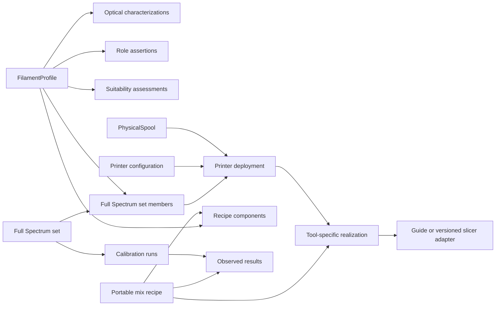

# Full Spectrum Product Direction Report

Status: **OWNER APPROVED — M7 implemented and validated**
Repository baseline: `0dac497b4` (`codex/m1-offline-openspool`)
Assessment date: 2026-09-08

## 1. Decision summary

SpoolForge should support Full Spectrum printing as a first-class, local-first experimental workflow built on the canonical `FilamentProfile` and `PhysicalSpool` model. Full Spectrum is not a property of a color swatch alone. It is an evidence-bearing relationship among physical filament behavior, a role assertion, a set of candidate profiles, a printer configuration, a portable mix recipe, and one or more observed calibration results.

The recommended architecture adds related entities rather than Full Spectrum columns to `custom_records` or a large group of nullable columns to `filament_profiles`. The existing compatibility record and NFC pipeline remain unchanged during the first milestone. Full Spectrum data stays in the application database unless a target codec explicitly supports a compatible field.

The first implementation milestone should establish terminology, richer TD characterization, role assertions, suitability assessments, and progressive-disclosure profile UI. It should not calculate guaranteed colors, recommend an allegedly optimal CMYG set, write private Full Spectrum fields to OpenSpool tags, or generate `.3mf` projects.

## 2. Status vocabulary used in this report

- **Existing:** present in the repository at the assessed commit.
- **Validated:** supported by inspected source, tests, schema, or cited primary documentation.
- **Proposed:** recommended design that is not implemented.
- **Assumed:** reasonable working premise requiring acceptance evidence.
- **Unknown:** insufficient evidence; the product must preserve this state.
- **Future:** intentionally outside the first implementation milestone.

## 3. Current project state relevant to Full Spectrum

### Existing and validated

- `FilamentProfile` is independent of owned spools and tag formats. It already holds typed observations, identifiers, a selected TD value, and TD history.
- `SourceRef` records provider, record/revision, evidence kind, retrieval time, and optional confidence. `profile_observations` and `profile_overrides` retain competing observations and a pinned current value.
- `PhysicalSpool` and `tag_bindings` separate product identity from owned instances and permit two verified tags per spool.
- User database v5 contains additive canonical tables beside compatibility tables. Migration 4→5 backfills stable profile/spool IDs and retains legacy records for rollback.
- `FilamentRecord` remains the compatibility model for the current Compose UI, NFC codecs, portable identity v1, local import/export, and legacy persistence.
- `transmission_distance_measurements` stores multiple TD values with source, evidence kind, optional date, and instrument. The current detail UI shows a single TD value and labels it as HueForge TD.
- `CatalogProvider` normalizes OFD, local, SpoolmanDB Community, and merged GTIN results into canonical profiles. Search supports text, identifiers, and basic product fields.
- The codec registry isolates Standard OpenSpool 1.0 and PAXX U1 Extended. The UI previews included and omitted fields before writing.
- The portable `filamajig.spool/1` QR and bundle preserve profile/spool identity and a compact compatibility snapshot.

### Existing limitations

- Canonical entities exist, but most working UI paths still operate through `FilamentRecord` and `CustomRecord`.
- The TD model has no unit, method, test geometry, wall thickness, notes, source URL, selection rationale, or explicit manufacturer/independent/inferred/estimated classification.
- A missing TD is represented by absence, but the UI does not explain why it is unknown or what test would improve it.
- Search reads all local custom records in memory and cannot filter by optical characterization, role, suitability, calibration, or inventory completeness.
- Color is primarily a name/HEX value. There is no appearance/effect taxonomy, role assertion, or separation of target, predicted, observed, and measured color.
- There are no Full Spectrum sets, recipes, calibration runs, printer configurations, tool assignments, or inventory recommendations.
- NFC/OpenSpool compatibility records cannot carry the proposed evidence graph.

## 4. Product direction

### Proposed

Full Spectrum becomes an optional but coherent product area with three entry points:

1. **Profile characterization:** record TD, optical behavior, candidate roles, suitability, and evidence.
2. **Set building:** select CMYG candidates from inventory, show missing or weakly evidenced roles, and bind physical spools to a printer configuration.
3. **Calibration and recipes:** create portable recipes, realize them against current tool assignments, print palettes, and record results.

The ordinary identify/edit/tag workflow remains compact. A collapsed Full Spectrum section appears after barcode, QR, AI, or NFC identification and expands only when requested or when evidence already exists.

### Canonical basis

- Mixing roles: Cyan, Magenta, Yellow, Gray.
- Non-mixing anchors: White and Black.
- Extensible roles: Neutral, Specialty, and namespaced/custom roles.

Gray is a deliberate CMYG mixing role. White and Black may be members of a working set, but they are anchors and are not presented as colors reliably synthesized by CMYG mixing. Specialty appearance effects are independent assertions, not a closed enumeration of colors.

## 5. Proposed domain boundaries

The boundaries are intentional:

- A profile describes a reusable filament product/color/package.
- An optical characterization is an evidence record, not a mutable truth column.
- A role is an assertion backed by evidence; it is not derived solely from RGB proximity.
- A suitability assessment is versioned reasoning over evidence and can coexist with user judgment.
- A set groups profile candidates. A deployment selects actual spool instances and tool positions.
- A recipe is portable. A tool sequence is a contextual realization of that recipe.
- A calibration result records what happened under specific physical conditions.

## 6. Proposed model

The names below describe domain concepts. Exact Kotlin and Room names may be adjusted during implementation without changing the boundary.

### `OpticalCharacterization`

- `id`, `filamentProfileId`
- `propertyKey` such as `transmission_distance`, `opacity_class`, or a future namespaced optical property
- typed value and unit; TD uses decimal millimetres
- `methodKey` and optional method version
- `originKey`: a validated string, using a core value below or an extension matching `x-<owner>.<value>`
- `confidence`
- `measuredAt`
- `testGeometry`, `wallThicknessMm`, `layerHeightMm`, and optional environmental notes where applicable
- `instrument`
- `notes`
- evidence reference and optional URL
- immutable creation metadata and supersession link

Unknown TD is represented by no accepted numeric characterization plus an explicit UI state. Importing the string `unknown`, zero, an unparseable value, or a guessed default must never create a numeric TD measurement.

The core origin vocabulary is `MANUFACTURER_PUBLISHED`, `INDEPENDENT_MEASURED`, `USER_MEASURED`, `EXPERIMENTALLY_INFERRED`, `ESTIMATED`, `CATALOG_REPORTED`, `COMMUNITY_REPORTED`, `LABEL_REPORTED`, `USER_REPORTED_UNSPECIFIED`, `MEASURED_UNSPECIFIED`, `INFERRED_UNSPECIFIED`, and `UNKNOWN_UNSPECIFIED`. Runtime validation, Room converters, import validation, and migration use this same set plus the explicit extension pattern.

Legacy evidence maps without upgrading certainty: `MANUFACTURER` to `MANUFACTURER_PUBLISHED`; `CATALOG` to `CATALOG_REPORTED`; `COMMUNITY` to `COMMUNITY_REPORTED`; `LABEL` to `LABEL_REPORTED`; `USER` to `USER_REPORTED_UNSPECIFIED`; `MEASURED` to `MEASURED_UNSPECIFIED`; `INFERRED` to `INFERRED_UNSPECIFIED`; and a missing or unrecognized value to `UNKNOWN_UNSPECIFIED`. Only a new record with an identified actor/method may use `INDEPENDENT_MEASURED`, `USER_MEASURED`, `EXPERIMENTALLY_INFERRED`, or `ESTIMATED`.

### `AppearanceAssertion`

- `filamentProfileId`
- extensible `appearanceKey`
- assertion value or strength
- evidence and confidence

Initial keys may include clear, translucent, metallic, silk, fluorescent, glow, wood-filled, stone-filled, or other effects, but the schema and UI must accept future namespaced keys. This entity is separate from Full Spectrum role.

### `FullSpectrumRoleAssertion`

- `id`, `filamentProfileId`
- `roleKey`: canonical `C`, `M`, `Y`, `G`, `WHITE`, `BLACK`, `NEUTRAL`, `SPECIALTY`, or extensible value
- `roleCategory`: `MIXING_PRIMARY` for C/M/Y/G, `ANCHOR` for White/Black, or `OTHER`
- `authority`: `MANUFACTURER_DECLARED`, `DATABASE_DECLARED`, `INFERRED_CANDIDATE`, `USER_CONFIRMED`
- `assertionState`: `ACTIVE`, `SUPERSEDED`, or `RETRACTED`; optional `supersededByAssertionId`
- evidence, confidence, notes, and asserted date

Several active assertions may coexist when different sources disagree. Profile display exposes that conflict and does not silently select one unless a user override or versioned policy does so. A blue-looking HEX value may be suggested as a candidate only when the application labels it inferred and explains the evidence; HEX alone is insufficient to confirm Cyan. A set member selects one concrete active assertion as its evidence. Set completeness counts exactly one active primary member for each C/M/Y/G mixing role. Anchor members are optional and never satisfy or block CMYG completeness.

### `FullSpectrumSuitabilityAssessment`

- `id`, `filamentProfileId`
- `assessmentKind`: `RECOMMENDED` or `OBSERVED`
- `rating`: `EXCELLENT`, `GOOD`, `USABLE`, `POOR`, `UNSUITABLE`, `UNTESTED`, `UNKNOWN`
- `scopeKind`: M7 supports `PROFILE` and `ROLE`; `ROLE` requires a concrete `roleAssertionId`, while `PROFILE` forbids one
- `policyId` and `policyVersion` for calculated recommendations
- structured factor references and human-readable rationale
- evidence, confidence, assessor, assessed date, and supersession

Calculated and user-observed assessments remain separate. A policy update creates a new assessment; it does not rewrite historical observations.

Scope is not stored as free text or an overloaded ID. M7 uses `scope_kind` plus nullable `role_assertion_id` with a database check enforcing the valid combination and an index for profile/role queries. M9 adds a separate `full_spectrum_assessment_contexts` relation with typed foreign keys to set and printer deployment. M10 extends that relation with a process/calibration fingerprint. This keeps M7 queryable without creating foreign keys to entities that do not exist yet.

### `FullSpectrumSet`

- `id`, name, description
- `classification`: `MANUFACTURER_CALIBRATED`, `COMMUNITY_CHARACTERIZED`, `USER_CHARACTERIZED`, `EXPERIMENTAL`
- `status`: `COMPLETE`, `INCOMPLETE`, `CALIBRATING`, `CHARACTERIZED`, `STALE`, `ARCHIVED`
- evidence, confidence, characterized date, notes

`FullSpectrumSetMember` stores `setId`, `roleAssertionId` as a foreign key, redundant validated `roleKey` for constrained lookup, and `memberState` (`ACTIVE_PRIMARY`, `ALTERNATE`, or `SUPERSEDED`). Its `filamentProfileId` is derived through the referenced assertion rather than duplicated as independent truth. `primarySlotKey` equals the C/M/Y/G `roleKey` only for an active primary member and is null for anchors, alternates, and superseded rows. A unique index on `(set_id, primary_slot_key)` uses SQLite's multiple-null behavior to allow alternatives while preventing two active primary members for one C/M/Y/G role. Checks require the assertion to be active and its profile/role/category to match the membership at creation; superseding or retracting an assertion transactionally marks dependent memberships stale until the user selects replacement evidence.

CMYG `MIXING_PRIMARY` members are required for a complete mixing set; White and Black `ANCHOR` members are optional. Adding or removing anchors does not change mixing completeness. Completeness queries join each active primary member to its concrete active role assertion and fail to `INCOMPLETE_CONFLICT` when that invariant is broken rather than guessing.

### `PrinterConfiguration` and `PrinterDeployment`

- Printer configuration: stable local ID, manufacturer/model, tool count, nozzle data, capability keys, notes.
- Deployment: set ID, printer configuration ID, date range/status, and a revision.
- Tool assignment: deployment ID, physical `spoolId`, set member/role, and opaque tool-position key.

Tool positions are strings governed by the printer adapter, not universal integers. A U1 adapter may display `T1` through `T4`; another machine may use bays or logical extruders. The reference deployment can map Gryddle Gray to T1, Snapmaker Yellow to T2, Anycubic Magenta to T3, and MarsWork Cyan to T4 while leaving all four TD and suitability states unknown until evidence exists.

### `MixRecipe`

- stable ID, name, recipe mode, material constraints, notes, provenance, and version
- optional nominal target color and its color-space declaration
- components referencing immutable `filamentProfileId` values or abstract role keys
- normalized parts/ratios
- an ordered cycle as a separate ordered list when sequence matters

Ratio and sequence are not interchangeable. `2 Cyan : 1 Yellow` is a portable ratio. `C,C,Y` is a portable cycle. `T4,T4,T2` is a realization under one deployment and must never become the recipe identity.

### `RecipeRealization`

- recipe ID, deployment ID and deployment revision
- resolved tool sequence and unresolved-role diagnostics
- generation time and adapter/version
- status: valid, incomplete, stale, or invalid

A realization becomes stale when a spool/tool assignment or relevant recipe revision changes. Translation fails closed when a role is missing, duplicated ambiguously, mapped to an unavailable spool, or incompatible with the printer.

### `CalibrationRun` and `MixResult`

- set/deployment IDs and immutable snapshots of member and tool mappings
- printer, slicer, slicer version, profile, material, layer height, nozzle diameter, orientation, geometry, date, and status
- planned palette definition, including 10-color and later 26-color templates
- per-recipe target, predicted, observed, and measured colors stored as distinct values
- declared color spaces: sRGB HEX/RGB and optional Lab/LCH
- optional Delta E only when the compared color space, illuminant, observer, and measurement method are recorded
- confidence, notes, and evidence/image references

An interrupted or partially completed run remains partial. Results from different geometry, lighting, layer height, or printer conditions do not silently merge.

## 7. TD handling and evidence basis

### Validated external basis

HueForge defines TD as a millimetre measurement of the thickness needed to block at least roughly 95% of transmitted light and treats it as central to layer-color prediction. HueForge also lists printed tests, community data, and the AJAX-3D TD-1 as distinct ways to obtain TD. Snapmaker states that Full Spectrum depends on light-transmitting filament, controlled/balanced TD, thin layers, opacity, and geometry.

Sources:

- [HueForge common terms](https://hueforge.wiki/index.php/Common_Terms)
- [HueForge FAQ](https://hueforge.wiki/index.php/FAQ)
- [Snapmaker Full Spectrum bundle](https://us.snapmaker.com/collections/snapmaker-u1-series/products/pla-full-spectrum-filament-bundle-4kg)
- [Snapmaker Full Spectrum introduction](https://blog.snapmaker.com/blog/four-filaments-a-full-spectrum-of-color/)
- [Snapmaker Full Spectrum slicing guide](https://www.snapmaker.com/blog/getting-started-with-full-spectrum-slicing/)

### Unknown and prohibited assumptions

No inspected primary source establishes universal numeric bands for Excellent, Good, Usable, Poor, or Unsuitable across materials, geometry, layer heights, colors, instruments, and viewing conditions. The first implementation must therefore show descriptive optical bands only when a versioned policy cites a validated basis. Until such a policy is validated, TD may inform a rationale but must not alone emit an Excellent/Unsuitable rating.

Manufacturer-published, independently measured, experimentally inferred, estimated, and unknown TD remain visibly distinct. Conflicting values remain separate and selectable; the application may recommend a current value only with an explicit selection rule and rationale.

## 8. Suitability reasoning

### Proposed initial policy

The first policy should be conservative:

- Manufacturer-calibrated and documented for the relevant workflow may receive a recommended rating with manufacturer evidence.
- A successful palette calibration may produce an observed rating scoped to its printer, process, and role.
- A known TD without role/opacity/palette evidence remains `UNTESTED`, not automatically Good.
- No TD and no calibration remain `UNKNOWN` or `UNTESTED` depending on whether the filament has been selected for testing.
- Opaque, specialty, or effect filament may be useful, but the application must explain that observed striping, contamination, and geometry can limit mixing.
- White and Black receive anchor suitability rather than CMYG mixing suitability.

The factor model should include TD evidence, opacity, role evidence, hue/saturation, consistency, manufacturer calibration, palette outcomes, striping, contamination, thin-layer compatibility, and user observations. Rules and weights require a separate reviewed policy artifact and fixtures before automated rankings are enabled.

## 9. Inventory intelligence

### Proposed deterministic capabilities

Without predicting colors, the application can safely report:

- whether active inventory has confirmed or candidate C/M/Y/G roles;
- missing roles;
- available White/Black anchors;
- alternate candidates per role;
- measured versus unmeasured TD;
- calibrated, tested, untested, stale, or conflicting evidence;
- complete and incomplete saved sets.

“Strongest set” recommendations are future behavior. They require a versioned scoring policy, minimum evidence rules, conflict handling, and an explanation of why each member outranks alternatives. Insufficient data must produce “test needed,” not a fabricated winner.

## 10. Search and filtering

### Proposed

Extend `CatalogQuery` with a Full Spectrum filter object rather than adding unrelated scalar parameters. Candidate filters include role assertion and authority, suitability/rating kind, TD range and measurement origin, set membership, calibration status, tested mixes, appearance keys, and owned-spool availability.

Search must query canonical Room projections/indices rather than load all local records. Suggested derived/indexed projections may expose current selected values while retaining the evidence tables as truth. Free-text examples such as “Cyan PLA with measured TD 5–8 mm” should compile to structured filters; the UI must show active filters and unknown exclusions.

Catalog providers may supply observations and assertions, but provider claims never become user-confirmed roles or measured values through normalization alone.

## 11. Barcode, QR, AI, NFC, RFID, and OpenSpool implications

### Existing and retained

Barcode, QR, label AI, and NFC remain identification inputs. They may create proposed observations with source metadata. Verified NFC writing retains frozen intent, capacity checks, overwrite consent, read-back, and durable unknown outcomes.

### Proposed boundaries

- Label AI may extract printed TD, role, or “Full Spectrum” claims only as label evidence requiring review.
- A package QR payload is decoded and retained as evidence; its presence is not equivalent to a retail barcode.
- Application-generated portable exports may eventually add a versioned Full Spectrum extension or a separate companion bundle. Portable identity v1 remains readable and unchanged.
- Standard OpenSpool fields and PAXX-supported fields remain exactly documented by their codecs.
- Full Spectrum role, suitability, measurement history, recipes, sets, and calibration results remain application-private until a target standard defines compatible fields.
- The write preview must list Full Spectrum data retained locally and omitted from the tag.
- `transmission_distance` remains a SpoolForge/PAXX payload extension that the pinned U1 firmware ignores; it must not be described as OpenSpool-standard or printer-consumed.

## 12. UX direction

### Profile detail

Add a collapsed Full Spectrum card containing role, TD status, suitability, test state, and evidence count. Expanded content shows competing measurements/assertions, provenance, confidence, and actions to characterize or add to a set. Unknown is a useful state with a next action.

Suggested badges are compact summaries, not truth substitutes: `FS Tested`, `FS Untested`, `Cyan candidate`, `CMYG member`, and evidence-backed suitability. Badge accessibility text must include the status and basis.

### Dedicated Full Spectrum area

- Inventory readiness and missing-role analysis
- Set builder with alternatives and evidence warnings
- Printer deployment/tool assignment
- Portable ratio/cycle recipe editor
- Calibration-run wizard and result capture
- Tested recipe browser

### Calibration workflow

1. Select or create four candidate profiles.
2. Assign C/M/Y/G roles with evidence state.
3. Choose physical spools and printer configuration.
4. Confirm contextual tool placement.
5. Generate four originals plus six 50/50 pairings.
6. Freeze printer, slicer, layer, nozzle, geometry, and recipe snapshots.
7. Print and mark the run complete, partial, or failed.
8. Record observations and optional measured colors/evidence.
9. Create observed suitability assessments without overwriting recommended assessments.
10. Offer versioned 2:1/1:2 and 26-color extensions only after the base run is recorded.

The workflow must support manufacturer-calibrated sets and experimental mixed-brand sets without treating them as equally evidenced.

## 13. API direction

The first milestone requires no network API. Domain services should expose local interfaces for characterization, set completeness, recipe validation, and tool realization. Future sync/community APIs should exchange immutable observations, evidence references, supersession links, and schema versions rather than flattened “best” values.

AI scan response schemas may later add candidate appearance, role, and TD claims, but accepted results must pass typed validation and preserve the image/label evidence classification. A model prediction is `INFERRED` or `LABEL`, never `MEASURED`.

## 14. Slicer integration feasibility

### Validated

Snapmaker documents Full Spectrum in Snapmaker Orca from 2.3.3 and currently describes Ratio, Cycle, Match, and Gradient modes. Its current Full Spectrum bundle guidance asks users to use Snapmaker Orca 2.3.6 or later. Snapmaker also documents that white and black are printed as separate filaments, that roughly 50/50 pairings can produce secondary colors, and that results vary with layer height, nozzle, model geometry, and printing conditions.

Standard OrcaSlicer documents that compatible 3MF project settings may be imported and incompatible data may be ignored. Full Spectrum project serialization is therefore a versioned adapter concern, not part of the portable recipe model.

Sources:

- [Snapmaker Orca](https://www.snapmaker.com/en/snapmaker-orca)
- [Snapmaker Full Spectrum bundle and mode descriptions](https://us.snapmaker.com/collections/snapmaker-u1-series/products/pla-full-spectrum-filament-bundle-4kg)
- [OrcaSlicer 3MF import/export documentation](https://github.com/OrcaSlicer/OrcaSlicer/wiki/import_export)

### Recommendation

MVP output should be an on-screen/exportable setup guide: physical role-to-tool assignments, portable ratio/cycle, resolved tool sequence, material/profile references, and warnings. Direct `.3mf`, slicer-profile, or palette-project generation remains a research milestone. It requires:

- pinned Snapmaker Orca versions and source inspection;
- documented or reverse-engineered schema isolated behind an adapter;
- golden `.3mf` fixtures created and reopened in the exact supported slicer;
- round-trip preservation tests;
- refusal on unknown versions or incompatible tool counts;
- clear separation from standard OrcaSlicer support.

No direct project generation is committed by this proposal.

## 15. Community data direction

### Future

Shared data could include TD measurements, role assertions, calibration runs, recipes, palette images, and scoped results. A submission should be append-only evidence with contributor identity/pseudonym, source, method, conditions, timestamps, device/instrument, and license/consent metadata.

Moderation should use schema validation, duplicate detection, outlier flags, evidence completeness, contributor history, and reversible status changes. Conflicting values remain visible as a distribution; moderation does not average them into false authority. Manufacturer verification, independent measurement, community replication, and single-user observation must remain distinguishable.

Community sync is not part of the initial local milestone.

## 16. Schema and migration impact

### Proposed migration sequence

Every milestone uses an additive Room migration and keeps `custom_records`, `recents`, and existing canonical tables intact. The initial v5→v6 migration belongs only to M7.

| Database version | Milestone | New tables or schema responsibility |
|---|---|---|
| v6 | M7 | `optical_characterizations`, `appearance_assertions`, `full_spectrum_role_assertions`, `full_spectrum_assessments`, `full_spectrum_assessment_factors`, and `evidence_references`; role category/scope constraints and indices |
| v7 | M8/M9 | indexed current-value/search projections as required, `full_spectrum_sets`, `full_spectrum_set_members`, `printer_configurations`, `printer_deployments`, `tool_assignments`, and typed assessment contexts |
| v8 | M10 | `mix_recipes`, `mix_recipe_components`, `mix_recipe_cycle_steps`, `recipe_realizations`, `calibration_runs`, and `mix_results` |
| later reviewed version | M11/M12 | only schema proven necessary by slicer-adapter or shared-evidence design; no table is reserved speculatively |

Exact grouping of M8 search indices with v7 may be split into a separate migration if implementation order requires it, but v6 must contain only M7 schema.

The target domain eventually includes:

- `full_spectrum_sets`
- `full_spectrum_set_members`
- `printer_configurations`
- `printer_deployments`
- `tool_assignments`
- `mix_recipes`
- `mix_recipe_components`
- `mix_recipe_cycle_steps`
- `recipe_realizations`
- `calibration_runs`
- `mix_results`
- `evidence_references` or an equivalent shared evidence component for new entities

This list describes the eventual target model. The version table above is authoritative for milestone scope.

Existing `transmission_distance_measurements` rows are copied exactly once during v5→v6 into richer optical characterization records with unit `mm`, the conservative origin mapping defined above, method `LEGACY_UNSPECIFIED`, and preserved source/date/instrument. After v6, `optical_characterizations` is the single source of truth for TD reads and writes. The canonical repository and profile UI use only the new table. The old table remains read-only for one compatibility release solely for rollback/export; no new or edited TD value is dual-written to it. A later reviewed migration may remove it after rollback/export acceptance. Missing fields remain null/unknown and are not defaulted. If a legacy row is malformed, migration retains it as quarantined raw evidence or fails transactionally according to the implementation ADR; it never creates a numeric characterization.

Migration acceptance must cover empty databases, v4→v5→v6, direct v5→v6, v6 containing only M7 tables, legacy TD present/absent/malformed, every known/missing evidence-kind mapping, conflicting TD values, duplicate identifiers, deleted local records, shared profiles, single-authority TD reads/writes, and rollback/export safety.

## 17. Backward compatibility

- Imported and saved records without Full Spectrum data remain valid and display no badge or `Unknown` only inside the expanded section.
- Existing NFC payloads and codecs remain byte-compatible.
- Portable identity v1 remains readable; no required field is added.
- Existing catalog assets need no immediate rebuild.
- Existing TD values are preserved as legacy-unspecified evidence, not upgraded to measured certainty.
- Full Spectrum entities reference stable canonical profile IDs. Recipes must not reference compatibility record IDs or mutable UI list positions.

## 18. Risks and failure modes

| Risk | Required control |
|---|---|
| Fabricated TD | No numeric default; typed validation; provenance and method required for accepted measurement |
| Origin vocabulary drift | One core origin-key set plus validated extension syntax shared by runtime, import and migration |
| False color certainty | Separate target, prediction, observation, and measurement; label predictions; retain conditions |
| RGB-derived role error | Role assertions require authority/evidence; HEX-only inference stays candidate |
| Invalid tool mapping | Resolve against deployment revision; reject missing, duplicate, stale, or unavailable mappings |
| Stale calibration | Snapshot set, profiles, tools, slicer, geometry, and process; mark stale on relevant revision changes |
| Conflicting measurements | Preserve each result; explicit selection; never silently average |
| Dual TD stores diverge | v6 copies once; new optical table is authoritative; legacy TD table is read-only for rollback/export |
| Incomplete CMYG set | Represent incomplete status and exact missing roles; do not generate a valid realization |
| Anchors counted as primaries | Role category discriminator; completeness counts only C/M/Y/G mixing primaries |
| Stale or ambiguous set assertion | Membership references a concrete active assertion; state/supersession propagates stale status; unique nullable primary-slot key enforces one active primary per role |
| Ambiguous assessment scope | Typed scope columns/relations with constraints and indexed foreign keys |
| Unsupported combination | Show untested; require calibration or manufacturer evidence before claiming suitability |
| Malformed imports | Size/depth/type limits, enum namespaces, decimal bounds, schema versioning, transactional import |
| Migration regression | Additive staged migrations, exported Room schemas, fixture migrations, compatibility tables retained |
| Snapmaker coupling | Core uses opaque tool keys and portable roles/recipes; Snapmaker behavior lives in an adapter |
| Slicer schema drift | Pinned adapter versions, golden fixtures, exact-app reopen tests, fail closed |
| Community evidence pollution | Append-only provenance, moderation state, outlier flags, no destructive merge |
| UI overload | Progressive disclosure and dedicated Full Spectrum workflow |

## 19. Recommended milestones

### M7 — Full Spectrum foundation

- terminology and canonical role/anchor distinction;
- richer TD/optical characterization with unknown state and provenance;
- role assertions and appearance assertions;
- calculated versus observed suitability entities;
- profile detail/edit UI with progressive disclosure;
- v5→v6 additive migration and migration tests;
- no automatic numeric suitability thresholds;
- no NFC wire-format change.

### M8 — Search and inventory readiness

- indexed structured filters for role, TD, measurement origin, suitability, test state, and ownership;
- deterministic CMYG completeness and missing-role analysis;
- alternate candidates with evidence, without “best” scoring until a reviewed policy exists.

### M9 — Sets and printer deployment

- reusable manufacturer/user/experimental Full Spectrum sets;
- optional White/Black anchors;
- printer configurations, physical spool selection, and contextual tool assignments;
- stale/incomplete mapping detection;
- reference U1 deployment without U1 coupling in core.

### M10 — Portable recipes and calibration

- ratio and cycle recipe model;
- portable recipe to deployment-specific sequence translation;
- 10-color calibration workflow, partial-run handling, observations, and evidence;
- extended 2:1/1:2 and 26-color templates after base workflow acceptance;
- target/predicted/observed/measured color separation.

### M11 — Guidance export and slicer feasibility

- deterministic setup/tool sequence export;
- Snapmaker Orca setup guidance;
- exact-version source/schema research and golden fixtures;
- owner decision on whether a version-pinned `.3mf` adapter is justified.

### M12 — Optional shared evidence

- local export/import schema first;
- moderation, licensing, privacy, provenance, conflict, and outlier design;
- community service only after local evidence behavior is proven.

Release engineering remains a parallel product gate and must not be weakened by these milestones.

## 20. Exact documentation changes recommended

- **This report:** authoritative proposed Full Spectrum direction pending owner approval.
- `docs/PRODUCT.md`: add Full Spectrum to the product promise, target users, principles, and bounded non-goals.
- `docs/ARCHITECTURE.md`: record the proposed domain boundaries and wire-format isolation.
- `docs/ROADMAP.md`: add M7–M12 after the implemented M0–M6 milestones.
- `README.md`: link the report and identify Full Spectrum as proposed direction rather than implemented behavior.
- `docs/decisions/`: add an ADR only after the owner approves the architecture.

## 21. Exact code areas likely to change after approval

- `core/.../DomainModels.kt`: optical characterization, role, suitability, set, recipe, calibration, and printer abstractions.
- `core/.../CatalogProvider.kt`: structured Full Spectrum query filters and evidence-bearing provider mappings.
- `app/.../data/CanonicalPersistence.kt`: new Room entities, DAOs, repositories, indices, and migration helpers.
- `app/.../data/Databases.kt`: user database version/migration registration and schema export.
- `app/.../data/CatalogProviders.kt`: map provider role/TD claims without promoting certainty.
- `app/.../MainViewModel.kt`: Full Spectrum state, commands, validation, inventory analysis, and lifecycle persistence.
- `app/.../MainActivity.kt`: progressive profile card and later dedicated workflows.
- `app/.../LabelScan.kt`: optional candidate TD/role/appearance extraction with typed evidence.
- `core/.../PortableIdentity.kt`: later optional versioned extension or companion export; v1 remains unchanged.
- `core/.../TagCodec.kt` and `OpenSpoolCodec.kt`: omission reporting only unless a supported standard changes.
- Room schema fixtures and focused host/device tests under `app/src/test`, `app/src/androidTest`, and `core/src/test`.

## 22. Refactoring required before broad implementation

M7 should first make the canonical repository the UI read/write source for the fields it introduces. Adding Full Spectrum state only to `FilamentRecord` or `CustomRecord` would deepen the compatibility-model split and lose evidence relationships.

Introduce small domain services rather than adding all logic to `MainViewModel`:

- `OpticalCharacterizationService`
- `FullSpectrumAssessmentService`
- `SetCompletenessService`
- `RecipeValidationService`
- `ToolRealizationService`

Replace local in-memory filtering with DAO-backed canonical queries before M8. Keep codec projection explicit: a mapper produces the limited `FilamentRecord` required by existing codecs and reports omissions.

## 23. Unresolved research questions

- Exact TD values and measurement protocol for Snapmaker’s CMYG bundle are not published in the inspected official material.
- Universal TD-to-suitability thresholds are unsupported and require controlled experiments or a defensible published basis.
- The stability and support policy of Snapmaker Orca Full Spectrum project serialization requires exact-version source and round-trip investigation.
- The best color prediction model and calibration target require empirical data; simple RGB averaging is not acceptable evidence.
- Lab/LCH and Delta E need a defined capture device, illuminant, observer, and calibration workflow before they can be treated as measurements.
- Cross-material recipes may fail mechanically or optically even when colors appear plausible; initial calibration should constrain material families.
- Community sharing requires licensing and privacy decisions for images and user evidence.

## 24. Owner decision

### Recommended product direction

Approve Full Spectrum as a first-class, optional SpoolForge workflow based on evidence-bearing optical characterization, role assertions, reusable CMYG sets, portable recipes, calibration results, and contextual printer deployments. Preserve White/Black as anchors and preserve unknown/test-needed states.

### Recommended first implementation milestone

M7: Full Spectrum foundation—richer TD characterization, extensible appearance and role assertions, recommended-versus-observed suitability, additive migration, and progressive profile UI. No recipes, automatic “best set,” wire-format additions, or slicer project generation yet.

### Major architecture decisions

1. Full Spectrum data is related canonical domain data, not nullable compatibility-record fields.
2. Portable recipes reference stable profile identities; tool sequences reference a versioned printer deployment.
3. Measurements and assessments are append-only evidence with explicit selection/supersession.
4. OpenSpool/PAXX codecs receive only supported fields and expose omissions.
5. Slicer output is adapter/version specific and follows a guidance-first feasibility gate.

### Schema implications

M7 requires an additive user database v5→v6 migration and new tables. Existing records, TD values, NFC payloads, portable identity v1, and compatibility tables remain valid.

### Reviewer findings

Initial review cycle `review-cycle-5ae7ccad7f5d` returned no findings from Grok or Gemini. DeepSeek identified five MEDIUM ambiguities: migration/version scope, absent unknown TD origin, dual TD-store authority, anchor-versus-primary role classification, and polymorphic suitability scope. All five were classified `CONFIRMED` and corrected. Closure cycle `review-cycle-c0a3db3d4377` confirmed those corrections but DeepSeek found a HIGH mismatch between the origin vocabulary and migration outputs plus a MEDIUM ambiguity in active assertion/set membership. Both were classified `CONFIRMED` and corrected above. Final targeted closure cycle `review-cycle-faa0b1374eeb` completed with no findings from Grok, Gemini, or DeepSeek. Final documentation evidence cycle `evidence-cycle-e53f4d546e82` passed format, report-structure, and documentation-only scope checks with artifact integrity confirmed.

### Exact work that begins if approved

Implement M7 domain types and Room entities; migrate legacy TD evidence conservatively; add DAO/repository APIs; add profile characterization and suitability UI behind progressive disclosure; preserve codec/portable-v1 behavior; add migration, domain, UI, and exact-device acceptance tests; then run the configured evidence and reviewer closure workflow.

M7 implementation validation completed on 2026-09-08. Evidence cycle `evidence-cycle-b1ee43b9c10f` passed the protected host suite, Room schema contract, wire/portable compatibility guard, diff check, and SHA-bound exact-device acceptance on a Motorola Razr 2023 running Android 16. The host suite contains 66 core and 72 app tests. Remediation review cycle `review-cycle-7cc7146ff0c6` closed with no remaining findings from Grok, Gemini, or DeepSeek. Release readiness and later Full Spectrum milestones remain separate gates.
